Summary

1.  Select a hyper-visor of your choice. ESXi… Hyper-V…VMWare
    Workstation… anything!

2.  Create Virtual Machine

3.  Install Windows Server 2022

4.  Login when its complete!

Before you begin:

-   Have a device that supports Virtual Machines, newer hardware
    preferred and recommended.

    -   Bare Minimum 4 Core CPU at 2.2ghz or above.

    -   At least 16GB of RAM.

-   Acquire a hyper visor for device (Select any of the following):

    -   Hyper-Visors for Desktops: VirtualBox, VMWare
        Workstation/Fusion, Microsoft Hyper-V

    -   Enterprise Level Hyper-Visors: VMWare Esxi, Hyper-V Server

    -   Cloud: AWS, Azure, Oracle, Google, Droplets

-   You need to provide at least **2 CPUs @ 1.9Ghz and 4GB of RAM** to a
    Windows Server 2022 server for it to run properly.

-   Download the ISO file for Windows Server 2022 Evaluation Version:
    [Click
    Here](https://www.microsoft.com/en-us/evalcenter/evaluate-windows-server-2022)  
      
    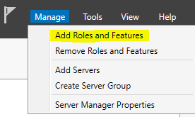

1.  Create a New Virtual Machine in the Hyper-Visor of your choice. I
    will be using VMWare Esxi via the vCenter Appliance. Please reach
    out to me if you need assistance with your hyper-visor.  
      
    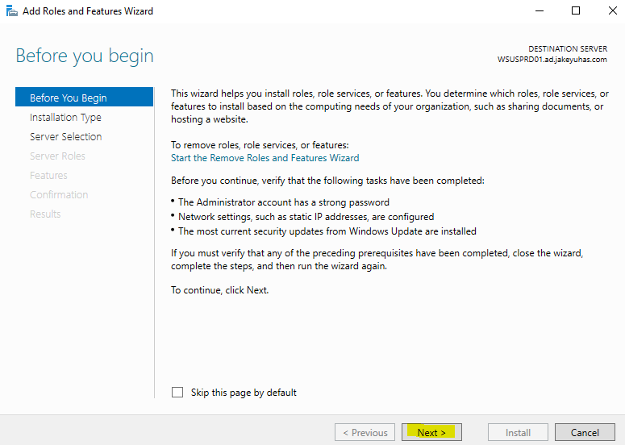  
      
    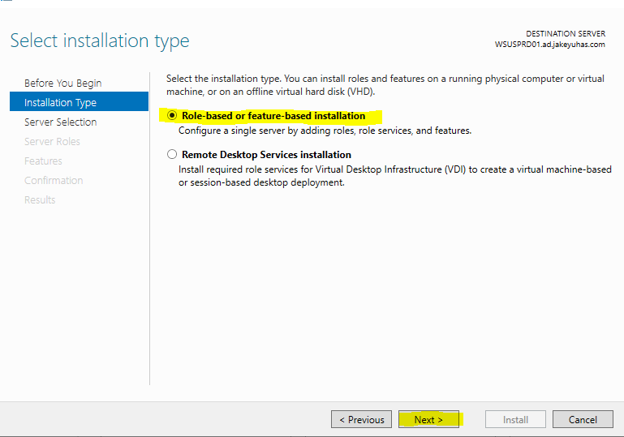

2.  For your virtual machine, name it **DC01**. In the next lab we will
    configure this to be a domain controller. However, if you just want
    to install Windows Server and play around, feel free to name it
    whatever you want.  
      
    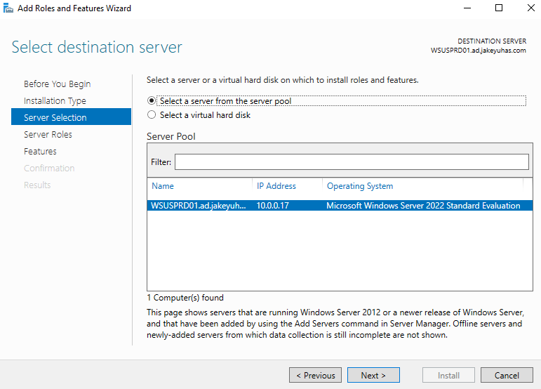

3.  **VMWare ESXi Only:** Select a compute resource or cluster depending
    on your configuration. If you do not have DRS enabled, select an
    individual host like I am.  
      
    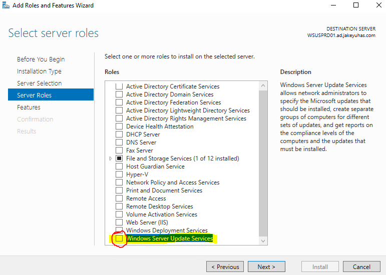

4.  **VMWare ESXi** **Only:** Select your storage. Use the local
    datastore for now if you do not have vSAN setup.  
      
    

5.  Most hyper-visors will ask you what Guest OS Family and Guest OS
    Version you are installing. Select **Windows** for Guest OS Family.
    For Guest OS Version, if it is available, select **Windows Server
    2022 (64-bit)**, if it is not, select **Windows Server 2019**.  
      
    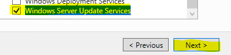  
      
    Note: You may keep **Enable Windows Virtualization Based Security**
    unchecked. It should not affect this installation or operation.

6.  For Virtual Hardware on any hyper visor, you want to configure **2
    CPUs** and **4GB RAM** for any Windows Server 2022 installation.
    Keep network to whatever default network your hyper-visor
    provides.  
      
    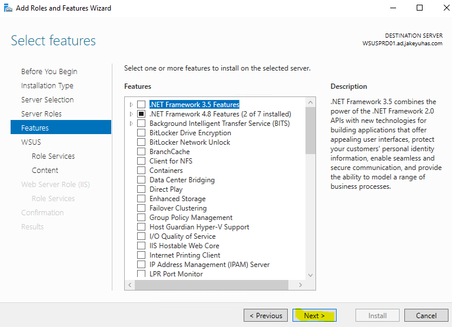

7.  IMPORTANT: Make sure you select for the CD/DVD drive **ISO Image**
    for Windows Server 2022.  
      
    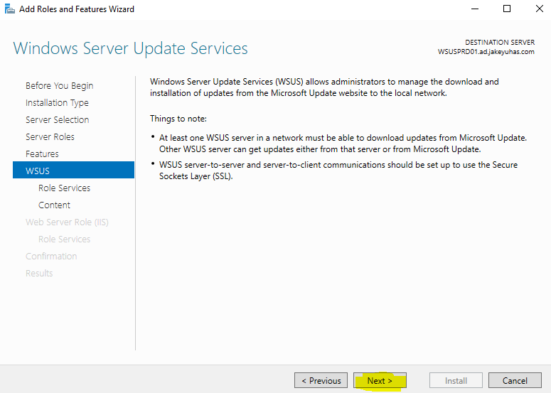  
      
    Here I am selecting my Windows Server 2022 Eval ISO file I
    [downloaded](https://www.microsoft.com/en-us/evalcenter/evaluate-windows-server-2022)
    from Microsoft.  
      
    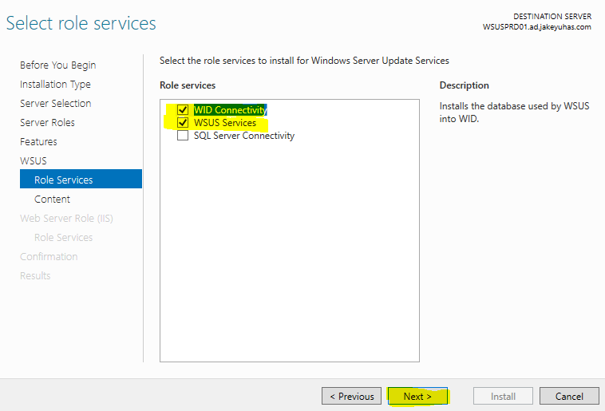  
      
    Make sure the file is selected and **Connect At Power On** is
    checked.

8.  Click **Finish**  
      
    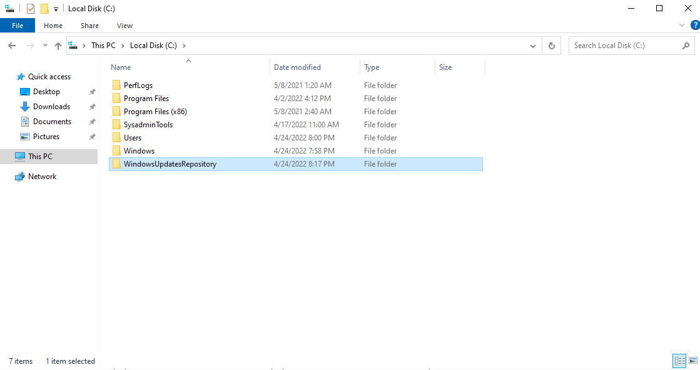  
      
    (Instructions continue on next page)

9.  Depending on your hyper-visor… speed of your computer and such… it
    should now appear in your inventory somewhere. For VMWare ESXi
    users, it will appear either under your standalone hosts, or within
    your cluster.  
      
    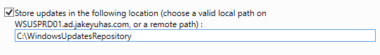

10. Now you will want to power on your brand new Windows Server 2022.
    Click on your Machine and power it on. In most hypervisors, this is
    a green Play button.  
      
    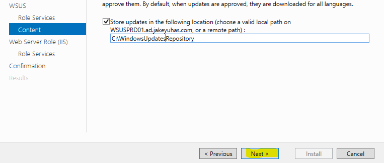

11. When you power it on, you will want to open the console to access it
    and move your mouse around. Now sometimes, it loads a little bit too
    fast by the time you open the console and will be attempting to boot
    from network PXE. We don’t want that. You want to boot from DVD/CD.
    If you are having trouble, hit **RESET** on the virtual machine, go
    back to your console and type in your keyboard fast so it is able to
    boot from CD.  
      
      
      
    Your result should be the blue screen showing **Microsoft Server
    Operating System Setup**.  
      
    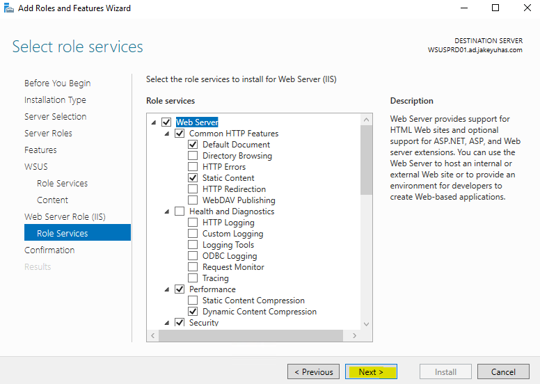

12. Once you are at the blue screen to select language, time and
    keyboard input we will begin the installation.

    1.  Language To Install: **English (United States)**

    2.  Time and currency format: **English (United States)**

    3.  Keyboard or input method: **US**

    4.  Then click Next.

13. The **Install Now** button will appear. Click on it.  
      
    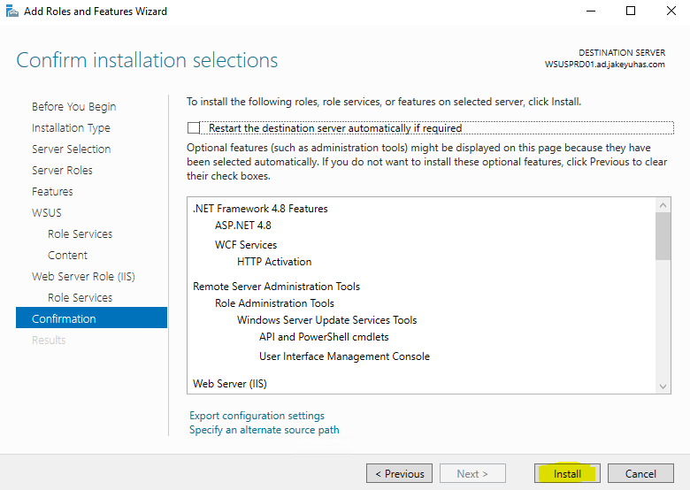

14. Setup will begin and this may take some time. You will eventually be
    prompted with a new window. You will want to select **Windows Server
    2022 Standard Evaluation (Desktop Experience)**.  
      
    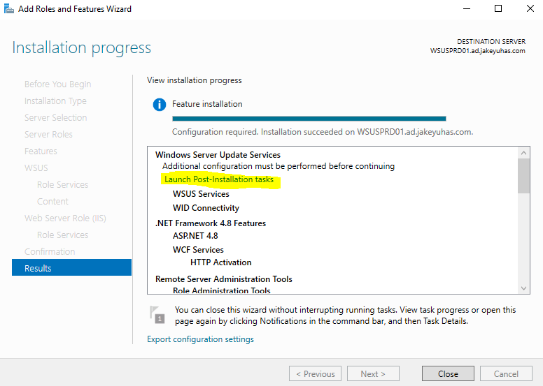  
      
    Click on **Next** after you have selected the correct one.

15. Click on the checkbox to accept the Microsoft Software License
    Terms.  
      
    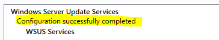  
      
    Click on **Next** after checking the box to agree to the EULA.**  
    **

16. For the **What Type of Installation Do You Want** screen, click on
    **Custom: Install Microsoft Server Operating System only
    (Advanced)**  
      
    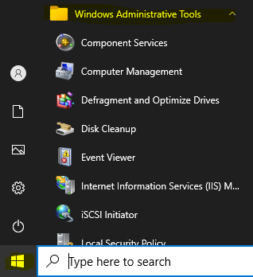

17. For the **Where do you want to install the operating system**
    screen, select **Drive 0 Unallocated Space**; and then click
    **Next**.  
      
    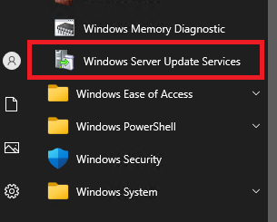

18. Windows will now begin installing. Be patient, depending on your
    system this can take a while. If you are running an SSD, it should
    take only a few minutes.  
      
    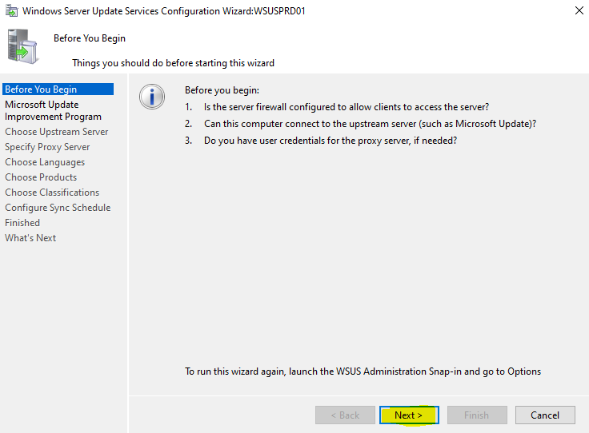

19. Eventually, it will complete and reboot on it’s own. Please be
    patient as this may take more time. When it fully comes back up from
    the reboot, you will be prompted with a Blue screen called
    **Customize Settings**. Enter in a decent password that you will
    remember to set for the Administrator account… and then click
    **Finish**.  
      
    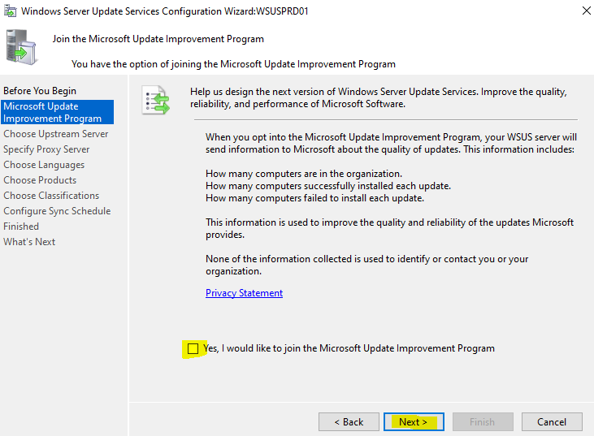

20. Once you reach the Windows *Ctrl+Alt+Delete* screen your
    installation as finished. To log in, most Hyper-Visors offer a
    button that will allow you to send a CTRL+ALT+DEL to your virtual
    machine. For VMware it is on the top-right of the console web
    browser.  
      
    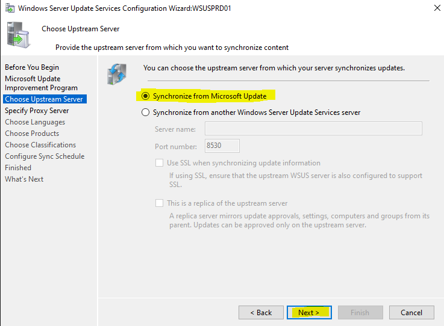

21. Enter the password you just set and press enter.  
      
    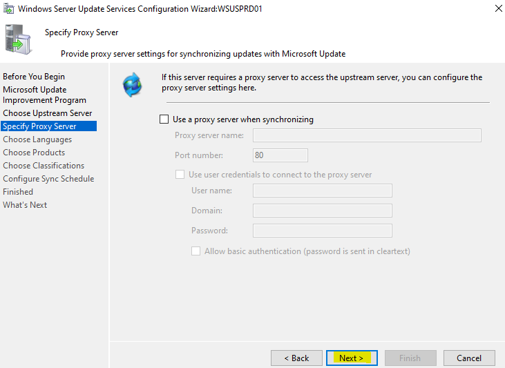

22. Wait a moment at the Desktop and don’t do anything. You want to wait
    for the blue pop out to come about from the right-side of the
    screen. It will be regarding Networks. Click **Yes** when it
    appears. (This just makes it easier to transfer files in if you need
    from other VMs or other physical devices on your network)  
      
    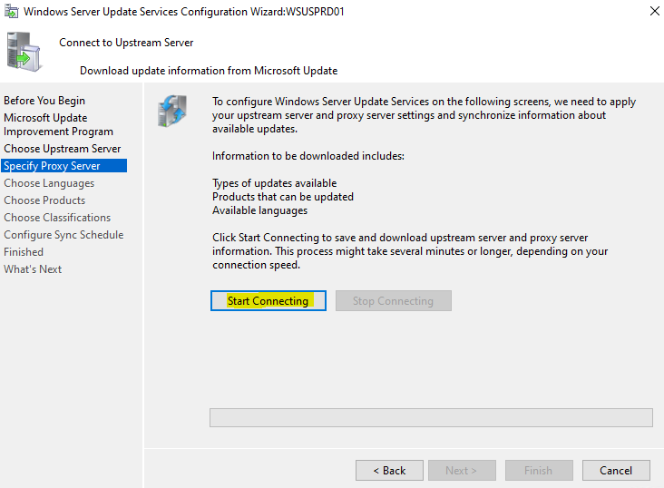

23. Now you are fully logged in and complete with this lab! Note to
    VMWare ESXi users, you will need to install VMWare tools to resize
    the screen (and other features as well). Oracle VirtualBox users
    will need a similar tool that is available with the VirtualBox
    program. Make sure to also enable Remote Desktop connections as
    well, it is disabled by default.
