Summary

1.  Select a hyper-visor of your choice. ESXi… Hyper-V…VMWare
    Workstation… anything!

2.  Requires 2 VMs, both windows and joined to the same Windows domain.
    I will be using **WSUSPRD01** and **DC01** for my example

Process:

1.  Log into **WSUSPRD01** as the Domain Administrator account

2.  Open **Server Manager**

3.  Click on **Manage \> Add Roles and Features**  
    **  
    ****  
    **

4.  On the *Before You Begin* page, click on **Next**.  
    **  
    ****  
    **

**  
**

5.  On the *Select Installation Type* page, ensure **Role-based or
    feature-based installation** is selected and then click **Next**.  
      
    

6.  Select the target server, which you are logged into. My server is
    **WSUSPRD01.ad.jakeyuhas.com**  
    **  
    ****  
    **

**  
**

7.  On the *Select Server Roles* page, scroll all the way to the bottom
    and check the box next to **Windows Server Update Services**  
      
    

8.  A pop-up window will appear, just click **Add Features**  
      
    

9.  Confirm that **Windows Server Update Services** is checked and then
    click **Next**  
      
    

10. On the *Select Features* page, just click **Next**.  
      
      
    **  
    **(Documentation continues on next page)

11. On the following page, click on **Next**.  
      
    

12. On the *Select Role Services* page, make sure **WID Connectivity**
    and **WSUS Services** are selected. Keep **SQL Server Connectivity**
    unchecked as we will be using the local WSUS database instead.  
      
    

**  
**

13. On the *Content location selection* page, pause here, and open up
    File Explorer.

14. Navigate to C:\\

15. Create a new folder called **WindowsUpdateRepository**  
      
    

16. Go back to the wizard in Server Manager

17. In the field put **C:\WindowsUpdatesRepository  
      
    ****  
    **

18. **Note: In a true production environment, you will want to create a
    separate hard drive for the virtual machine and give it about 100GB
    of free space (or more), and use that second hard drive to store
    only Windows Updates that the WSUS server will download. It should
    NEVER be on Drive C, as Windows Updates do take up a lot of space.
    If you ran out of space on Drive C… well… your virtual machine
    wouldn’t work anymore. If it ran out of space on Drive D, only WSUS
    stops working and your Windows OS is ok.  
    **

**  
**

19. Click **Next** after entering the file path of where you are going
    to store your Windows Updates.  
      
    

20. On the *Web Server Role (IIS)* page, click **Next.  
      
    ****  
    **

**  
**

21. On the *Select role services* page, just click **Next**. Note: As
    you may notice WSUS needs IIS to run so it is also installing IIS.  
      
    

22. On the *Confirm installation selections* page, click on **Install**,
    then go get some coffee.  
      
    

23. Once the installation has finished, you will need to click on the
    blue hyper-link that says **Launch Post-Installation Tasks**.  
      
    

24. Once you see the text change to *Configuration successfully
    completed*, you may close the wizard and Server Manager to get back
    to your normal desktop window.  
      
    

25. Click on the **Start Menu** button this will open the start menu

**  
**

26. Find the **Windows Administrative Tools** folder and click the arrow
    to drill down the selections  
      
    

27. Scroll all the way to the bottom until you see **Windows Server
    Update Services**, go ahead and click on that.  
      
    

28. You will be presented with a new wizard screen.

29. On the *Before You Begin* page, go ahead and click **Next**.  
      
    

30. On the *Join the Microsoft Update Improvement Program* page, uncheck
    the box and click **Next**.  
      
    

31. On the *Choose Upstream Server* page, ensure that **Synchronize from
    Microsoft Update** is selected as this is the first WSUS server we
    are introducing to the environment and then click **Next**.  
      
    Note: You can have multiple WSUS servers in your environment. This
    is a good practice as you may have satellite offices that are
    connected to the main work campus. You don’t want all the devices at
    the satellite campus downloading from the internet as that can cause
    network congestion and slow download speeds. You want a second
    downstream WSUS server at the satellite office, that downloads the
    updates from the main work campus WSUS server, so that it only
    crosses the internet once. Then the satellite office devices can
    download directly from the WSUS server locally.  
      
    

32. On the *Specify Proxy Server* page, just click **Next**. We won’t be
    setting up a proxy server for synchronizing Windows updates in this
    lab.  
      
    

33. On the *Connect To Upstream Server* page, click on **Start
    Connecting**, this will begin synchronizing your Windows Update
    Server.  
      
    

34. **This may take a very long time, or at least a few minutes, please
    take a break here and eat something.**

**  
**

35. When the synchronization is finished, the loading bar will turn
    fully green and the next button will become available. Click on
    **Next**.  
      
    

36. For the *Choose Languages* page, leave the defaults and then click
    **Next**.  
      
    

37. On the *Choose Products* page, check **All Products** and then
    **<u>UNCHECK</u>** it, so it deselects ALL of the updates. You don’t
    want to download and synchronize all products, that would take
    182312312 light years.  
      
    

38. Since we are only using Windows Server 2022, we want to scroll down
    to **Windows Server operating system-21H2** as Windows Server 2022
    is a reconfigured kernel of Windows 10 21H2. This title may change
    in the future!! Be aware.  
      
    

39. Once **Microsoft Server operating system-21H2** is selected, click
    on **Next**.

**  
**

40. On the *Choose Classifications* page, ensure **Critical Updates**,
    **Definition Updates** and **Security Updates** are selected and
    then click **Next**.  
      
    

41. On the *Set Sync Schedule* page, keep the **Synchronize manually**
    option selected and click **Next**. Note: In a production
    environment, you would probably want to set this to 3 or 4AM
    daily.  
      
    

42. On the *Finished* page, make sure the checkbox next to **Begin
    Initial Synchronization** is selected and click **Next**.  
      
    

43. On the *What’s Next* page, click on **Finish**.  
      
    

44. This will open the **Update Services** console.

45. If you click on the **Synchronization** label, it will open the
    current synchronizations running.  
      
    

46. If you click on any of the syncrhonizations that are on-going, it
    will give you the status on the bottom half of your screen.  
      
    

**  
**

47. When you click on completed synchronizations, it will list some
    details regarding what the server found for new updates.  
      
    

48. Since we have a synchronization running, we will let it run. In the
    meantime, we will perform Group Policy Configuration on **DC01**, we
    need to tell devices in the domain to look at **WSUSPRD01** for new
    Microsoft Windows updates instead of the internet.

49. Log into **DC01** as your Domain Administrator account

50. Open **Group Policy Management**, you can find this under **Windows
    Administrative Tools** in the Start Menu.

51. Once opened, navigate to your **Default Domain Policy** within the
    Group Policy Management console. (See picture below)  
      
    

52. Right-Click the Default Domain Policy and click **Edit**  
    **  
    ****  
    **

53. This will open the **Group Policy Management Editor**

54. In the navigation tree on the left, navigate to the following:

    1.  **Computer Configuration**

    2.  Click on the arrow next to **Policies**

    3.  Click on the arrow next to **Administrative Templates: Policy
        Definitions (ADMX Files)**

    4.  Click on the arrow next to **Windows Components**

    5.  Scroll down and then click on **Windows Update  
        **

55. You will see the right-screen populate with several policies to
    configure. They should all state **Not configured**.

56. Find the setting that states **Specify intranet Microsoft update
    service location**, right-click it and click on **Edit**  
      
    

**  
**

57. On the *Specify intranet Microsoft update service location* page:

    1.  Click on **Enabled**

    2.  Set the intranet update service for detecting updates:
        [**https://wsusprd01.ad.jakeyuhas.com**](https://wsusprd01.ad.jakeyuhas.com)

    3.  Set the intranet statistics server:
        [**https://wsusprd01.ad.jakeyuhas.com:8531**](https://wsusprd01.ad.jakeyuhas.com:8531)

    4.  **NOTE: IF YOU ARE NOT USING ACTIVE DIRECTORY CERTIFICATE
        SERIVCES, CHANGE THE TWO TEXT FIELDS TO
        http://wsusprd01.ad.jakeyuhas.com:8530. In the previous lab we
        configured Active Directory Certificate Services and created a
        template to request a new certificate. If you have not finished
        this lab, use normal http with port 8530. If you HAVE completed
        this lab ignore this note.  
          
        ****  
          
        (Documentation continues on next page)**

**  
**

58. Click on **Apply** and **OK** to commit the changes.

59. Note: If you wish to also configure automatic updates, there is a
    setting called **Configure Automatic Updates**. Right-Click and Edit
    the policy, set it to **Enable** and then click **Apply** and
    **OK**. With the default settings this will check for updates
    automatically every day at 3AM. This setting is seen enabled in
    production environments, but definitely not for a hospital. We like
    to control our updates and when they happen in a hospital setting.
    For a normal office, set it up for 3PM on a Friday and tell your
    employees to leave their PCs online when they leave for the day.

60. Log out of **DCPRD01** when you are finished.

61. Now that Group Policy is configured to our liking we now need to
    setup a new certificate on **WSUSPRD01** so that updates can be
    downloaded over https. These next steps require the previous lab to
    be completed.

62. Log back onto **WSUSPRD01** and Open the **Internet Information
    Services (IIS) Manager**, you can find this under the **Windows
    Administrative Tools** folder in the start menu.

63. Click on **WSUSPRD01** in the Navigation tree so that it is
    highlighted, this will change your center screen.  
      
    

64. On the center of the console, <u>double-click</u> on **Server
    Certificates**  
      
    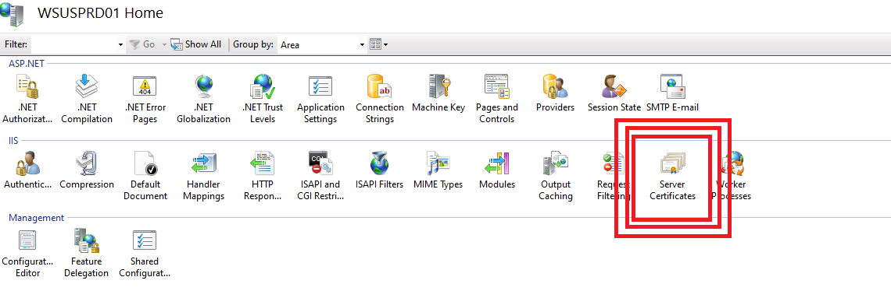

**  
**

65. On the right-side of the console you will see **Actions**. Click on
    **Create Domain Certificate**  
      
    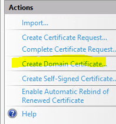

66. This will open up a **Create Certificate** screen.. fill in the
    following information:

    1.  Common Name: **wsusprd01.ad.jakeyuhas.com**

    2.  Organization: **AD**

    3.  Organizational Unit: **IT**

    4.  City/Locality: **Worcester** (or whatever city you are in)

    5.  State/Province: **MA** (or whatever state you are in)

    6.  Country/Region: **US** (or whatever country you reside in)

    7.  **Click Next**.  
          
        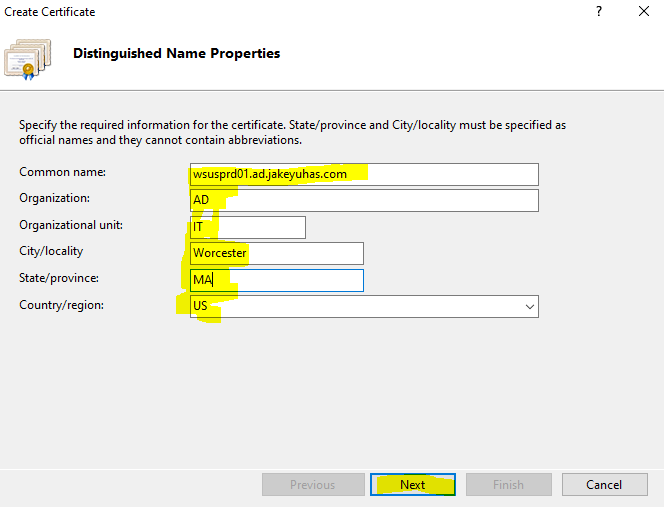

67. On the next page, it will ask you to specify an online certification
    authority, click on the **Select** button on the right side of the
    window.  
      
    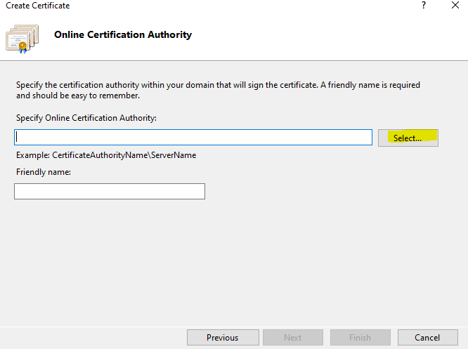

68. You should see your Certificate Authority server listed on this
    screen, select it so that it is highlighted in blue and then click
    **OK**.  
      
    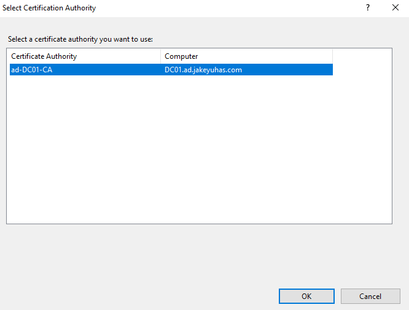

69. Nice.

70. The **Specify Online Certification Authority** field should now be
    populated.

71. For **Friendly Name**, put in the full FQDN of the server, so mine
    would be **wsusprd01.ad.jakeyuhas.com**  
    **  
    **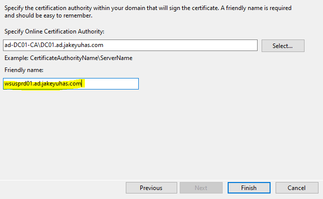**  
    **

72. Click **Finish**.

73. The **WSUS** server should be immediately given a new certificate
    from the Root CA server. Now we need to bind this to the IIS
    website.  
      
    (Documentation continues on next page)

**  
**

74. In the navigation pane on the left side of the console drill down
    **Sites** and then right-click on **WSUS Administration**. Click on
    **Edit Bindings**.  
      
    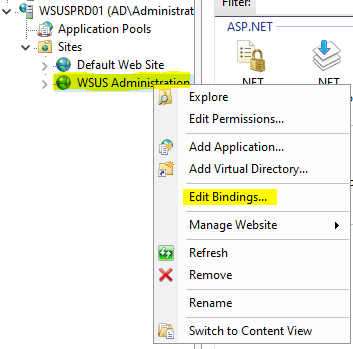

75. In the Site Bindings menu, click on the type that says **HTTPS** and
    then click **EDIT**  
    **  
    ****  
    **

**  
**

76. In the Edit Site Binding menu make sure the following is set:

    1.  IP Address: **All unassigned**

    2.  Port: **8531**

    3.  Host Name: **KEEP THIS BLANK**

    4.  SSL Certificate: **wsusprd01.ad.jakeyuhas.com**

    5.  Then click **OK** after reviewing the screenshot below  
          
        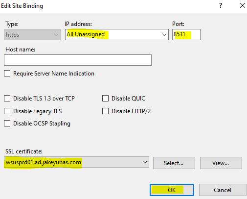

77. Then click on **Close** on the **Site Bindings** menu screen.

78. Then close the **IIS** manager window all together.

**  
**

79. Open **Powershell** with **Run As Administrator  
      
    **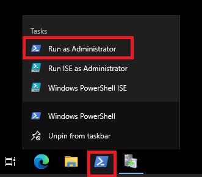**  
    **

80. In the powershell terminal, type **IISReset**. This will stop and
    then start the IIS services. We want to do this so that the services
    can properly bind the certificate we just assigned to port 8531.  
    **  
    **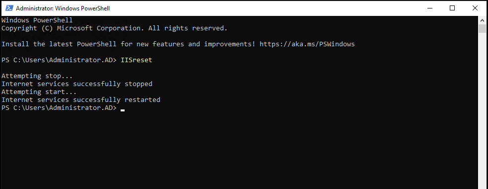**  
    **

81. **Note: If you had the Update Services console window open during
    this time, close it fully and then re-open it**.

82. Go back to the Windows Server Update Services console and navigate
    to **WSUSPRD01 \> Computers \>** **All Computers**

**  
**

83. At the top of the middle pane in the console, set the **Status** to
    **Any**. You should begin to see other servers or workstations on
    your domain begin populating here.  
      
    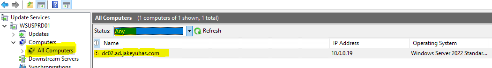  
      
    It looks like **DC02** checked in but not **DC01**.

84. If you have a server/workstation that is domain joined but cannot be
    detected on the WSUS server, log into that server/workstation and
    perform the following steps:

    1.  Open a **Powershell** terminal as **Administrator  
        **

    2.  Execute the command: **gpupdate /force  
          
        **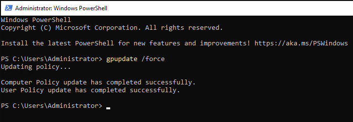**  
        **

    3.  Now that we forcefully refreshed the device’s group policy
        settings, we will now force it to check into the WSUS server.
        Write these commands down somewhere, they may save you some time
        someday.

    4.  In the same elevated Powershell terminal execute: **wuauclt
        /detectnow  
        **

    5.  Then execute another command: **wuauclt /reportnow  
          
        **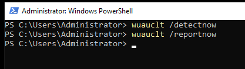**  
        **

**  
**

85. Those commands should force the server/client to check in with the
    WSUS server. You can confirm this by returning to the WSUS server
    and clicking **Refresh**.

86. If the server is still not present, **Reboot the server.** Please
    note that sometimes it just takes a bit for servers to report into
    the WSUS server.

87. Since I have a server reporting into the WSUS server, I am going to
    approve the first round of updates.

88. On **WSUSPRD01**, right-click **All Computers** in the **Update
    Services** console and click **Add to Computer Group**.  
      
    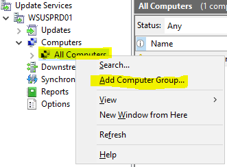

89. Name this group **Domain Controllers** and then click **Add**.  
      
    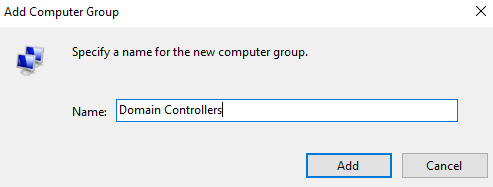

90. The new group will now appear under **All Computers** in the
    navigation tree.  
      
    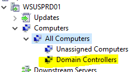

91. Within **All Computers** right-click on **DC01** or **DC02** and
    click **Change Membership**  
      
    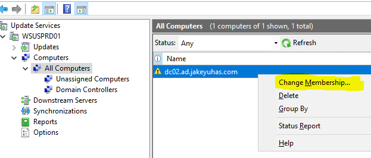

92. In the **Set Computer Group Membership** pop-up, check the box next
    to **Domain Controllers** and click **OK**.  
      
    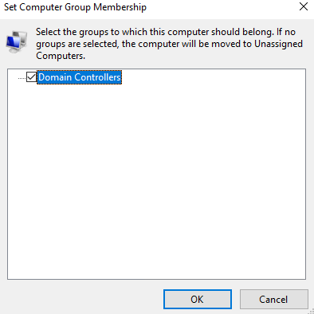

93. This action just assigned **DC02** to the **Domain Controllers**
    <u>Computer Group</u>. This is how you can further organize to send
    update to a select group of computers, giving you as a System
    Administrator more granular control of deployment rings for monthly
    patching.

94. Navigate to **WSUSPRD01 \> Updates \> All Updates**, and sort the
    approval by **Unapproved** with the status set to **Failed Or
    Needed** and click refresh.  
      
    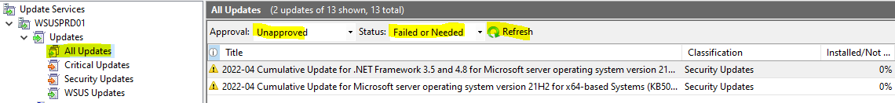

95. Click one of the updates in the center console so it is highlighted
    blue, then use key combination **CTRL+A** to highlight all of
    them.  
      
    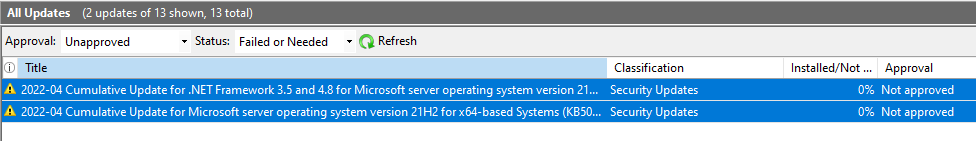

96. Right-click the highlighted stack of updates and click
    **Approve**.  
      
    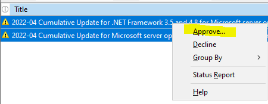

97. On this next page you can select if you want to **approve** the
    updates for certain computer groups or even all the computers that
    report to the WSUS server.  
      
    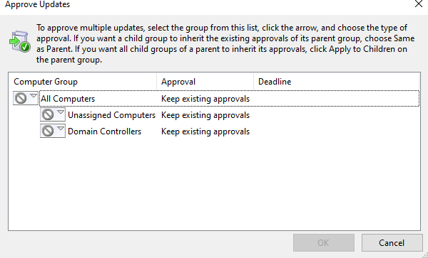

98. If you click on the  you can change the
    approval status of the given computer group or all.

99. For my example, I am going to approve the update for all servers
    that check into this WSUS server. Click on **Approved for Install**
    for **All Computers**.  
      
    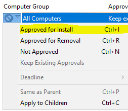

100. FYI, when you reach to step 100 in Word, the tabulation gets weird,
     so please excuse the text.

101. It should turn into a **Green Checkmark** and then you can click
     **OK**  
       
     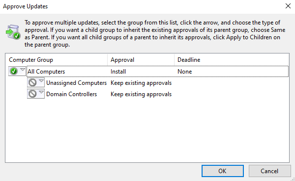  
       
     (Documentation continues on next page)

102. Then the Approvals are complete it will show you the results.  
       
     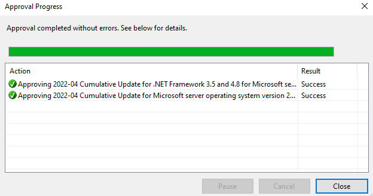

103. Click on **Close**, this should make the window disappear.

104. If you change the **Approval** to **Approved** at the top of the
     console and click **Refresh** it should now show the updates as
     approved. Keep in mind that these updates only apply to **Windows
     Server 2022**, but since we applied it to All computers, it means
     that any computer that is **Windows Server 2022** that is pointed
     to **WSUSPRD01** will download and install the listed updates from
     this WSUS server.

105. Log onto any server that has checked into the **WSUSPRD01**
     already, in my case that is **DC02** for me.

106. On **DC02**, I opened Windows Update and clicked on **Check For
     Updates**.  
       
     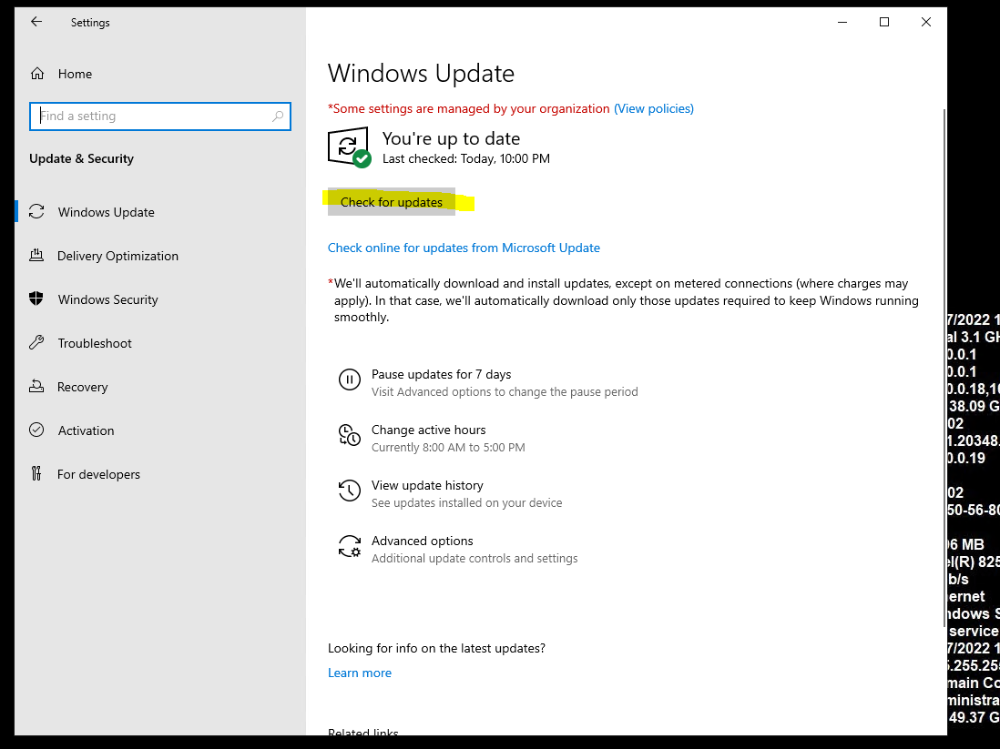

107. **DC02** immediately began downloading and installing the updates
     from **WSUSPRD01**.  
       
     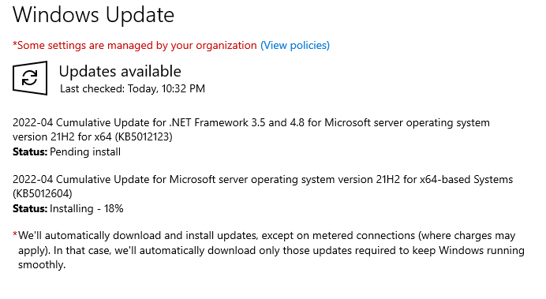

108. That concludes this lab for the most part!

109. **Key Takeaways  
     **

     1.  Setting up WSUS is kind of time consuming, but once it is
         setup, it makes updating/patching servers easier. I would say
         the same for desktops/workstations but a large number of
         employees are now remote. Microsoft has released a new product
         called **Intune**, this is geared towards remote workers and
         updating/patching their devices using Microsoft Azure /
         Microsoft Cloud Services. **Intune** is a way better fit for
         managing remote devices.

     2.  There are third party products that deliver updates to Windows
         Servers/Workstations such as:

         1.  Ivanti Endpoint Manager (formerly called LANDesk)

         2.  Patch by Ivanti

         3.  PatchMyPC

         4.  PDQ Deploy

         5.  Automox

         6.  ManageEngine

         7.  Atera

     3.  Microsoft Owned Patch Management Tools:

         1.  Windows Server Update Services – For Servers and
             On-premises devices

         2.  Windows Update For Business (going away soon)

         3.  Windows Autopatch – For desktops/laptops

         4.  Microsoft Intune – For Desktops/laptops/mobile devices that
             are on-premises or remote!

         5.  SCCM / Config Manager – For Desktops and Servers,
             on-premises only.

         6.  **MECM – Microsoft Endpoint Control Manager** – this is
             when **Intune** and **SCCM/Config Manager** are used
             together, it is referred to as MECM.

     4.  Patching/Updating Servers and end user devices is easy, it’s
         reporting and validation that is a true challenge on the job
         for multiple organizations.

     5.  If the traditional Windows Update isn’t working, you can visit
         **<https://www.catalog.update.microsoft.com/home.aspx>** and
         download the manual windows update installer for almost any
         update. Monthly Cumulatives, .NET, Drivers etc., whatever
         Microsoft offers to WSUS, you can find it here in it’s own
         individual package for you to download.

         1.  Type: **YYYY-MM** to find the current month’s updates. So
             if I typed **2022-04**, that would be April of 2022 updates

     6.  **Microsoft** releases their monthly public patches on every
         **2nd Tuesday** of the Month. They never miss a beat
         either.

     7.  **Always** test the latest patches on a non-production or lab
         machine first to make sure it does not break your system
         entirely. Microsoft is known to release patches in the past
         that break the OS. For example, they had to pull back the
         updates to fix a bug back in **January 2022** that was causing
         Windows Server 2016 server’s that were Domain Controllers to be
         stuck in a reboot loop. We decided to not patch our Domain
         Controllers that month and waited for February’s updates

     8.  You should **ALWAYS** patch your servers monthly at the LATEST…
         and your servers should have anti-virus installed to ensure
         they are safe and secure if attackers were to ever attempt
         common exploits against Windows, web browsers
         (Google/Firefox/Edge), Office products etc. Patch EVERYTHING!
         (It’s literally my job at work so I say patch everything)
