Summary of Activities

1.  Installed ESXI on each host (steps not shown, just notes)

2.  Deleted Old Datastores leftover from old build on the NVMe drives
    (steps not shown, just notes)

3.  Cleared the partitions on the NVMe drives (steps not shown, just
    notes)

4.  Configured NTP servers

5.  Started ntpd service

6.  Enabled SSH on all three hosts

7.  Disabled USB arbitrator to allow USB flashdrives to be seen as
    storage (not to be used in enterprise environments)

8.  Added USB “Fling” driver for USB to Ethernet driver support (not to
    be used in enterprise environments)

9.  Set host name and domain name

10. Key takeaways

11. Results

<!-- -->

1.  Installed ESXI on all three hosts.

2.  Deleted old datastores on all three hosts

3.  Cleared partition table on all three host's NVMe drives from old lab
    build

4.  Configured NTP settings on all three hosts.

    1.  Navigator \> Manage \> System \> Time & Date

    2.  **Edit NTP Settings  
        **

    3.  Selected **Use Network Time Protocol (enable NTP client)  
        **

    4.  NTP service startup policy set to **Start and stop manually  
        **

    5.  NTP Servers set to **0.north-america.pool.ntp.org,
        1.north-america.pool.ntp.org, 2.north-america.pool.ntp.org,
        3.north-america.pool.ntp.org**  
        **  
        **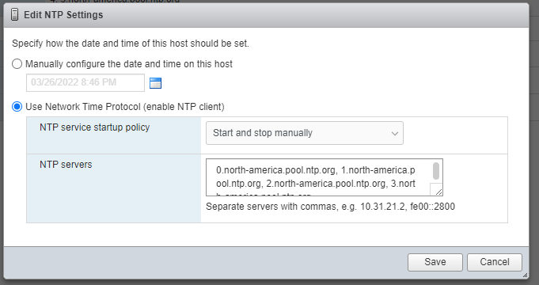

    6.  Click **Save**.  
          
        (Documentation of steps continues on next page)

5.  Started **ntpd** service on each host

    1.  Navigator \> Manage \> Services

    2.  Right-click on **ntpd** and clicked **Start  
        **

    3.  Validated it showed running.  
          
        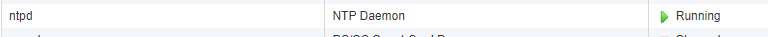

    4.  Validated UTC time matched current UTC time. *Host \> System
        Information  
        *

6.  Enable SSH for each host in preparation for custom options

    1.  Navigator \> Host

    2.  Click on **Actions  
        **

    3.  Hover on **Services** in the drop-down menu

    4.  Select **Enable Secure Shell (SSH)  
          
        **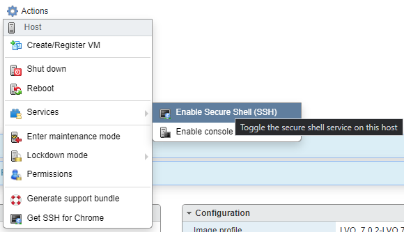

7.  Disable USB Arbitrator Service (this can also be done via CLI) –
    **SKIP THIS IF NOT USING USB devices for Datastores.  
    **

    1.  Navigator \> Manage \> System \> Advanced Settings

    2.  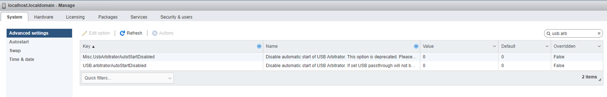Click in Search
        Textbox, type **usb.arb  
        **

    3.  Click on *USB.arbitratorAutoStartDisabled* and then click on
        **Edit Option** at the top.

    4.  Set **USB.arbitratorAutoStartDisabled** to **1  
        **

    5.  A restart of the Esxi host will be required to apply this
        change. This will allow USB devices to be seen directly by the
        Esxi host to be used as storage devices. Note that this is NOT
        recommended to be used in an enterprise environment.  
          
        (Documentation of steps continues on next page)

8.  Installing USB to Ethernet Driver (Fling) – **Skip if not using USB
    to Ethernet adapters  
    **

    1.  Click on your available Datastore under **Storage** in the
        navigator

    2.  Click on **Datastore Browser  
        **

    3.  Click on **Create Directory  
          
        **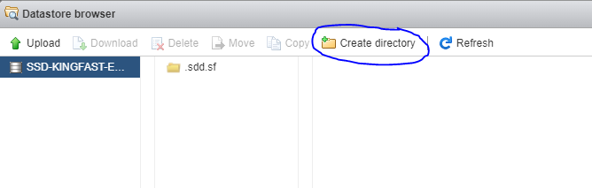**  
        **

    4.  Directory name should be **FlingDriver**. Click on **Create
        Directory**.  
          
        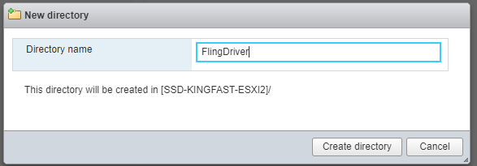

    5.  Click on the **FlingDriver** directory. The upload button should
        now be green.

    6.  Click on **Upload** (Steps continued on next page)

    7.  Upload the zip file you have (fully zipped no need to extract).
        It should now show in the directory.  
          
        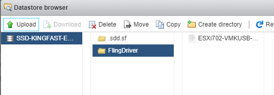

    8.  Connect to host via SSH

    9.  Place host into maintenance mode: **esxcli system
        maintenanceMode set -e true  
        **

    10. Locate the zip file you uploaded within the CLI. It should be
        under
        **/vmfs/volumes/\<VOLUMENAME\>/FlingDriver/\<NAME-OF-FILE\>.zip  
        **

    11. Note, before you attempt to run the next command. If there is a
        pending reboot, the machine MUST be rebooted prior to installing
        the USB NIC driver.

    12. Note, your USB to Ethernet NIC should **NOT** be plugged in. If
        the command below is failing, unplug the USB to Ethernet NIC and
        reboot. Make sure to re-enable SSH

    13. 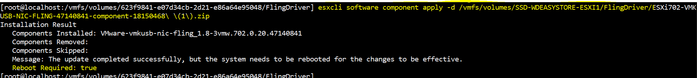Run: **esxcli
        software component apply -d
        /vmfs/volumes/VOLUMENAME/FlingDriver/FLINGDRIVERPACKAGENAME.zip  
          
        **Note: Replace the **red** with your actual volume name and
        when you get to *Flingdriver/* just hit TAB, it will
        autocomplete the entire file name – and yes… you need to use the
        full directory path, even if you are in the same directory.

    14. 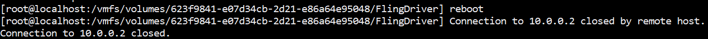Type **Reboot** to
        reboot your ESXi machine.

    15. Note, I believe this package can also be installed via the web
        browser through **Manage \> Packages \> Install Update**, same
        thing as in the CLI, you have to use the exact directory of the
        zip file.

    16. To validate that it installed. Log in to the web console of the
        esxi host directly and go to **Manage \> Packages**. On the
        right side of the Packages interface, there is a search bar.
        Search for “fling” and the **vmkusb-nic-fling** package should
        appear after the reboot.

    17. Click on **Networking** in the Navigator

    18. Click on **Physical NICs** (plug in your USB to Ethernet NIC
        now, it’s safe to do so)

    19. Your USB to Ethernet NIC should now be showing as **vusb0**.  
          
        (Documentation of steps continues on next page)

9.  Renaming the hosts

    1.  Log into the web client

    2.  Place host into maintenance mode

    3.  Click on Networking in the Navigator

    4.  Click on **TCP/IP stacks  
        **

    5.  Click on **Default TCP/IP stack  
          
        **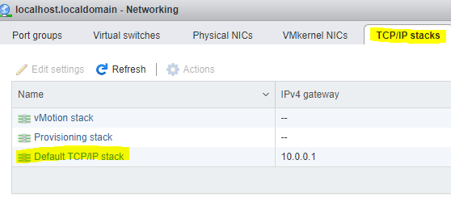**  
        **

    6.  Click on **Edit Settings  
          
        **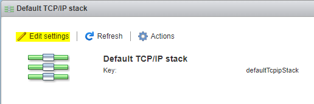**  
        **

    7.  Click on **Manually configure the settings for this TCP/IP
        stack  
        **

    8.  NOTE: I had already reserved the IP address on my Edgerouter-X
        for each host and my router supports DNS forwarding.

    9.  Set Hostname to whatever you wish to name the host, in my case,
        **esxi1**.

    10. For the **Domain Name** if you own one, you may use it. However,
        **local** is…. Ok if you have nothing else. I will be using
        **ad.jakeyuhas.com** as I own that domain and nobody else can
        control the DNS records but myself.

    11. For the **Search Domains** I used **ad.jakeyuhas.com  
          
        **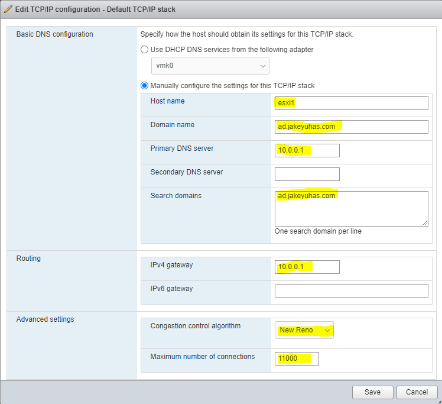**  
        **

    12. Primary DNS server, IPv4 Gateway, Congestion Control, Maximum
        number of connections I left to default.

    13. I repeated this step for each host.

10. Key Take Aways from this Lab That I wrote and what I learned
    performing these steps a 2nd time.

    1.  Disable Secure Boot for Lenovo M720Q (tiny) computers since Esxi
        does not know how to interact with it on this platform. The
        Lenovo M920Q host was able to recognize the Secure Boot and did
        not cause an interrupt during boot.

    2.  After setting the USB Arbitrator to disabled, I was unable to
        install the Fling driver. I had to reboot before installing a
        new package. Again, this could be something to do with utilizing
        consumer hardware for a ESXi. – The second theory is that a USB
        to Ethernet device was plugged in when attempting to install the
        package; which probably caused a volume to be locked. – I am
        unsure of exactly what the issue was but with anything in IT,
        rebooting seems to fix the issue.

    3.  ESXi hosts were immediately picked up by DHCP and given a lease.
        I went into my EdgeRouter-X and went ahead and reserved the IPs
        each host picked up and bound it to each host’s MAC address so
        they remain static and always remain to have that IP address.

11. Results

    1.  Browsers reflecting new hostname FQDN  
          
        

    2.  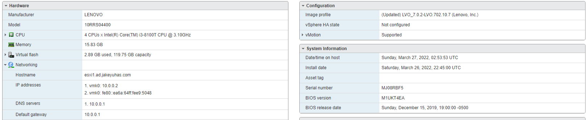Esxi1.ad.jakeyuhas.com
        Host summary:

    3.  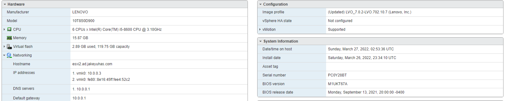Esxi2.ad.jakeyuhas.com
        Host summary

    4.  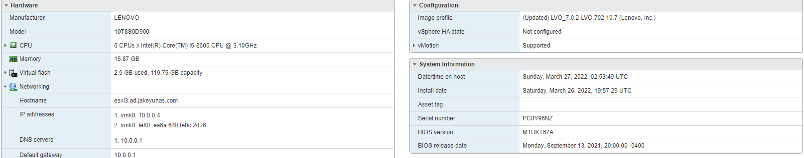Esxi3.ad.jakeyuhas.com
        Host summary

    5.  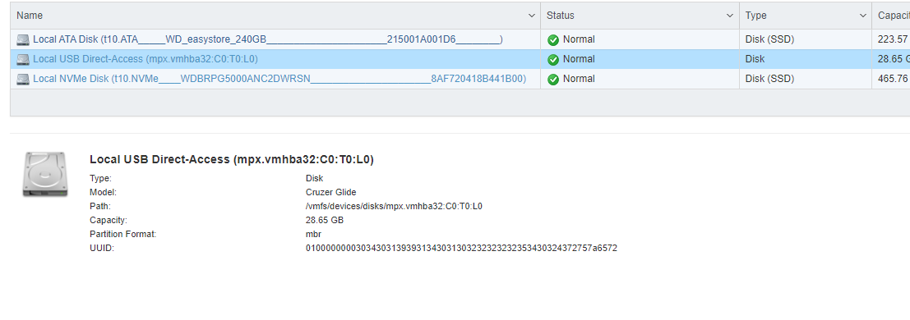Sandisk
        USB drive appearing via Local USB Direct Access

    6.  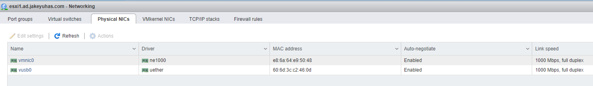Vusb0 appearing as an
        available network device (USB to Ethernet adapter)
