Summary of activities:

Deploy vSphere vCenter Server and add hosts to be managed by the
vCenter.

1.  Downloaded Installer (not shown)

2.  Ran installer on my personal computer, accepted EULA, pointed to
    **esxi1**, configured host to pickup via DHCP

    1.  The installer can be executed from any computer that can reach
        the target host the vCenter Server is being installed on. It is
        a remote installation tool. You can deploy from a virtual
        machine too, I just chose my personal computer for convenience.
        I was able to use the normal Windows 10 tools to mount the ISO.

    2.  Make sure to check **Enable Thin Disk Mode** when selecting the
        datastore.  
          
        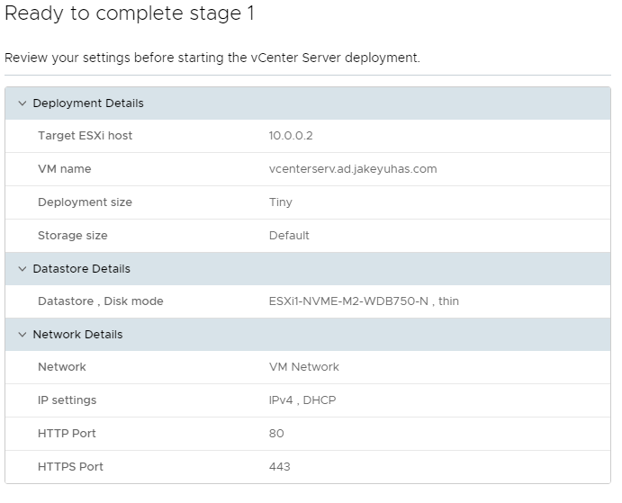

3.  Install Stage 1 initiated

    1.  Installer progress  
          
        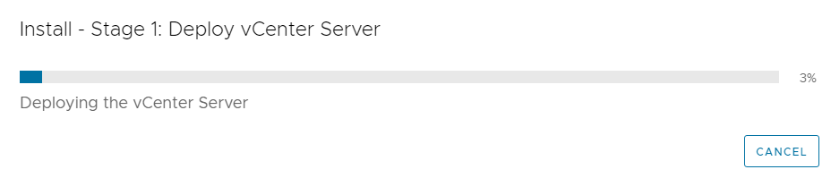

    2.  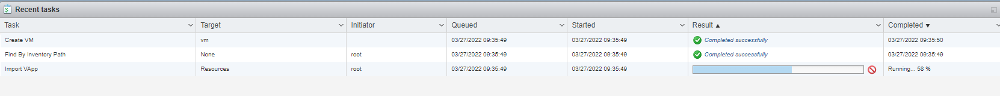The target host is
        showing the deployment under recent tasks as well.

4.  Stage 2

    1.  Stage 1 completed successfully  
          
        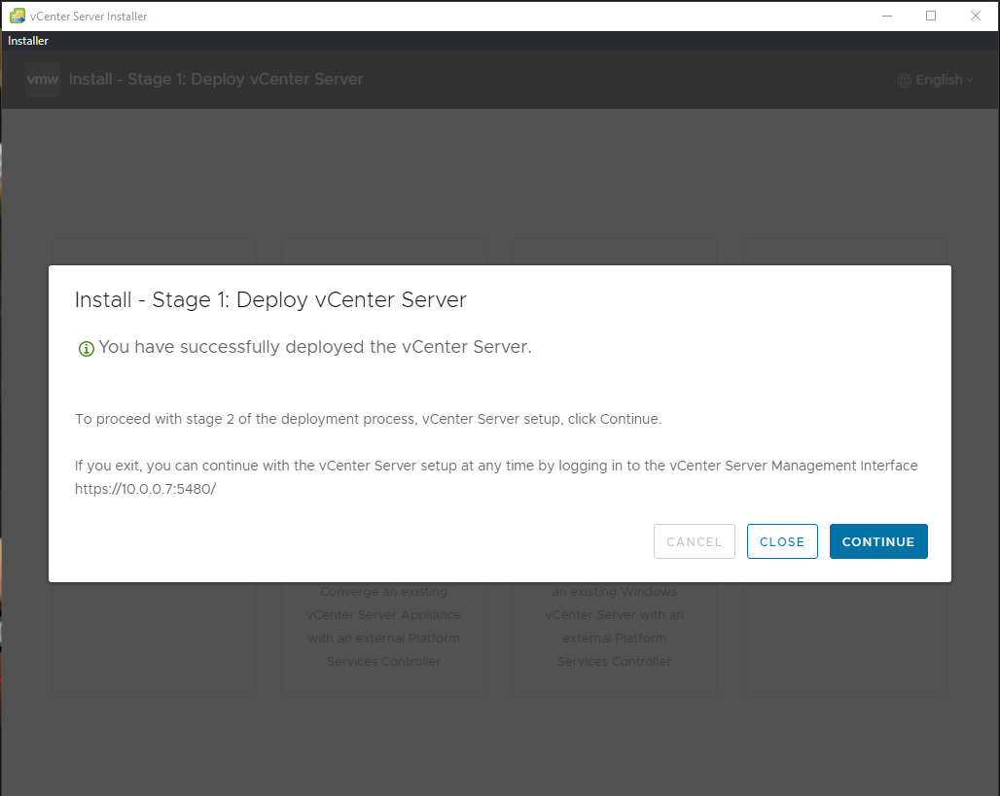

    2.  Introduction  
          
        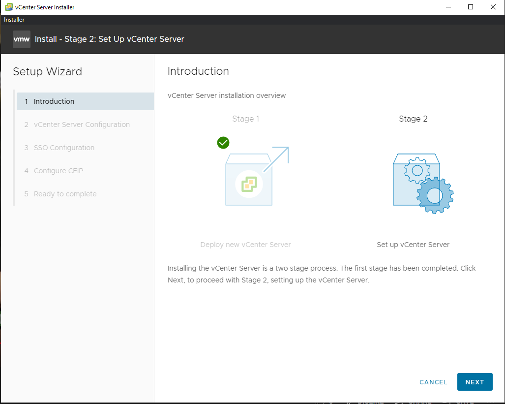

    3.  On the next page it prompted me for options regarding Time
        synchronization and SSH access. I will only configure the Time
        synchronization. Since the ESXi hosts are already synchronized
        with the North American pool servers from poolntp.org, I will
        have vCenter Server sync time with whichever host is currently
        hosting. I will not be doing SSH configuration as my lab is not
        equipped for vSphere HA.  
          
        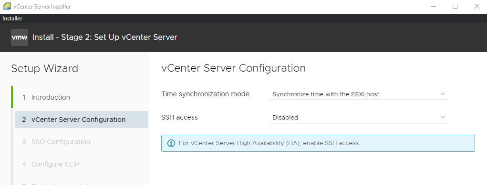

    4.  SSO Configuration: I will create a new SSO domain utilizing a
        domain I own already “jakeyuhas.com” – but will be using
        **sso.jakeyuhas.com** to ensure the DNS forwarding does not go
        out to the broader internet. I do not have Active Directory set
        up at this time, I would otherwise bring this into the
        **ad**.jakeyuhas.com domain if that were the case.  
          
        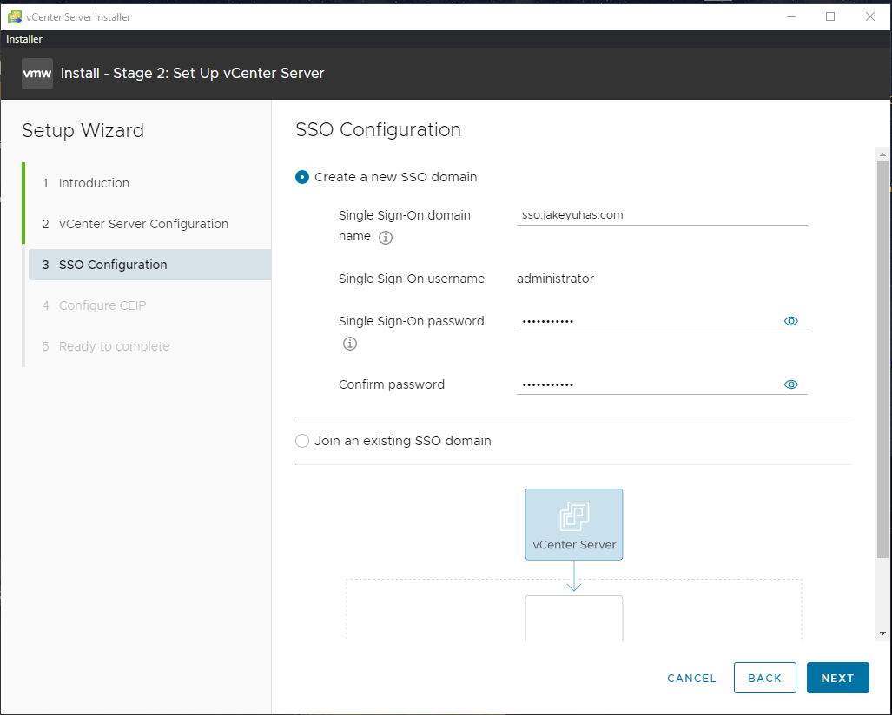

    5.  Configuring CEIP, I decided to not join VMware’s customer
        experience program.

    6.  Review Configuration  
          
        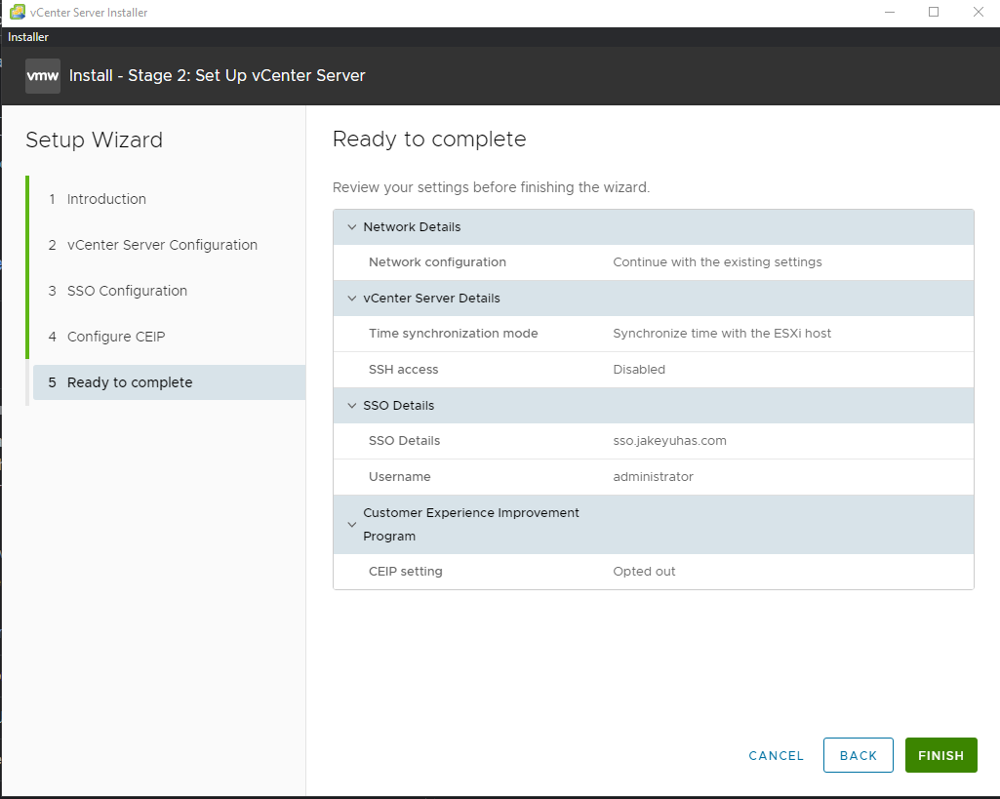

    7.  The installer now is finishing the last configuration steps.  
          
        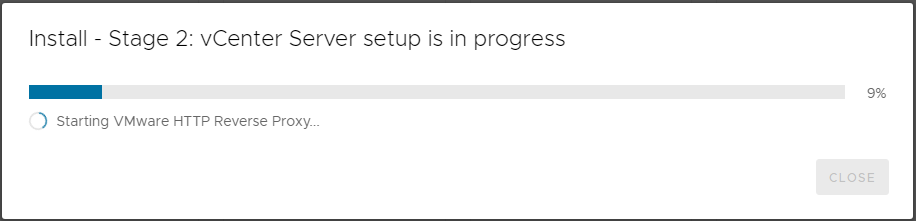

    8.  Stage 2 Completed  
          
        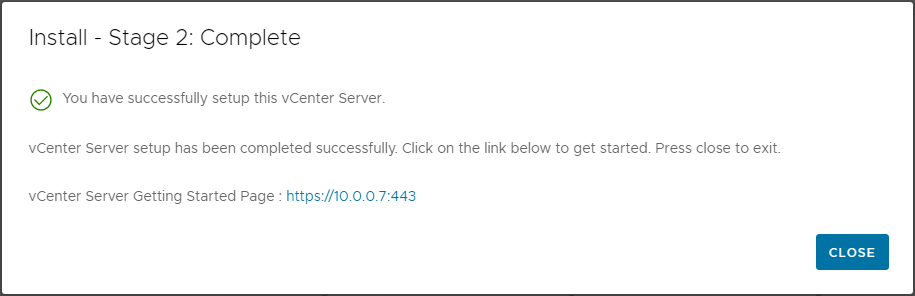

    9.  Now we will navigate to 10.0.0.7:443. There is a caveat here
        though, web browsers and vCenter Server do NOT get along when
        utilizing IP addresses. This can sometimes break the remote
        console window and transference of files. Since my base home
        router does not support routing, I went into my hosts file on my
        windows computer and pointed a url to 10.0.0.7 instead. – For
        clarification, my homelab is behind second router, my personal
        PC sits outside of the 10.0.0.0/24 network on 192.x.x.x.  
          
        I added: **10.0.0.7 vcenterserv.ad.jakeyuhas.com \# vsphere** to
        my hosts file. However, the appliance is not renamed yet. I will
        need a proper DNS server prior to this to be allowed to do this;
        and will do so at another time.

5.  Configuring a New Data Center

    1.  Right-Click on the vCenter Server appliance in the web
        management interface and click on **New Datacenter…  
        **  
        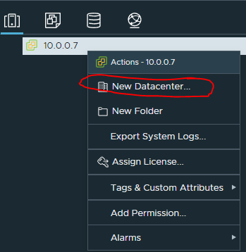

    2.  I named mine simply, “Homelab.”

6.  Creating a vSphere Cluster

    1.  Right-Click on the Datacenter that was just made and click on
        **New Cluster…**  
          
        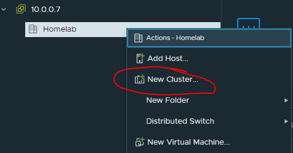

    2.  For now I am keeping the basics turned off. I will configure
        vSAN at another time.  
          
        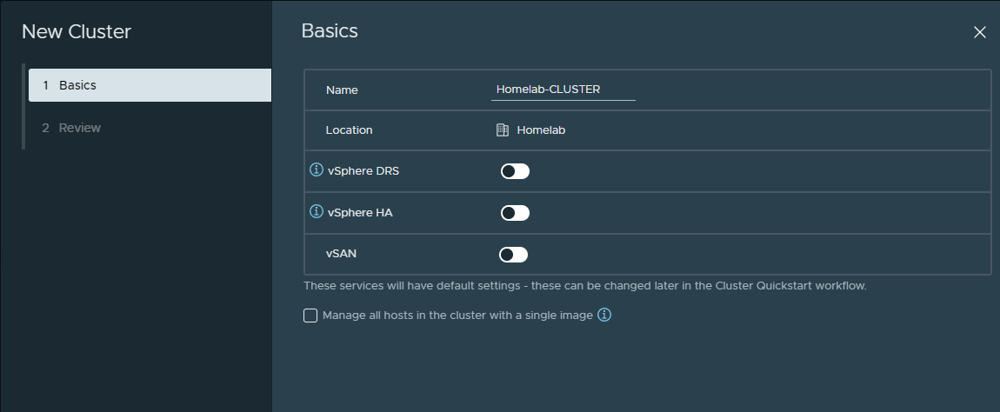

7.  Adding hosts to the cluster

    1.  Right-click on the cluster and click **Add Hosts…**  
          
        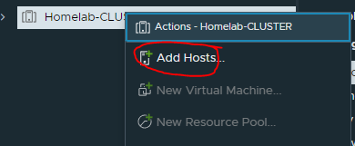

    2.  For now, I am only adding my other two hosts in which are not
        currently running anything. I do not want to lose access to my
        vSphere client.  
          
        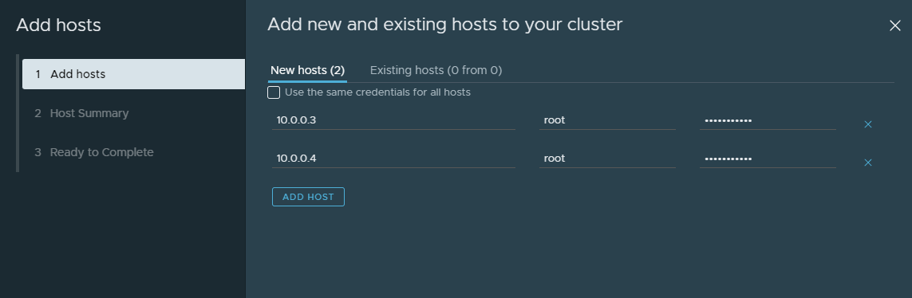

    3.  After clicking next and authenticating, it will provide a
        summary.  
          
        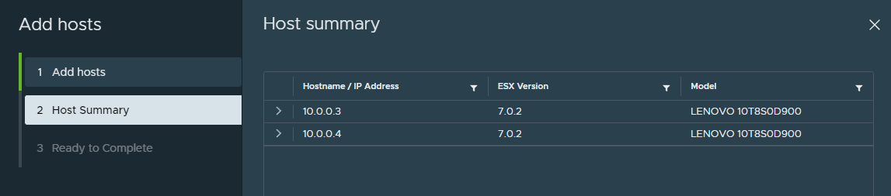

    4.  Then, click next one more time and it will prompt you that 2 new
        hosts will be added, but the hosts will be put into maintenance
        mode while they join the cluster. This is fine as there is
        nothing running on them currently.  
          
        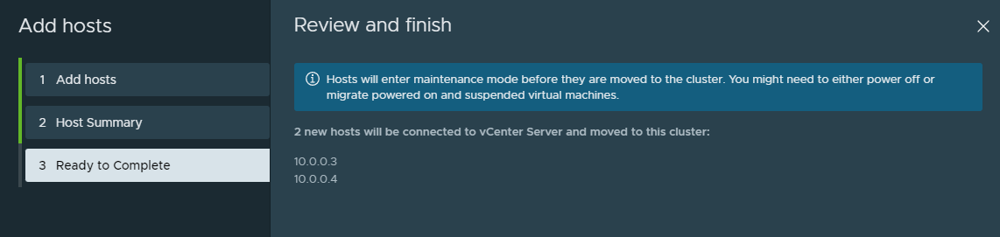

    5.  vSphere will take some time to add the standalone hosts to the
        cluster.

8.  Configuring Cluster

    1.  On the Homelab-CLUSTER Quickstart page, option 3, click on
        **Configure**  
          
        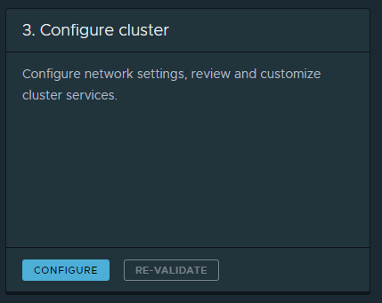

    2.  Since there are no services being configured at this time, it
        will only prompt me for creating a Distributed switch. I will be
        selecting **Adapter 1(vusb0)** to be part of this Distributed
        Switch group **DSwitch**.  
          
        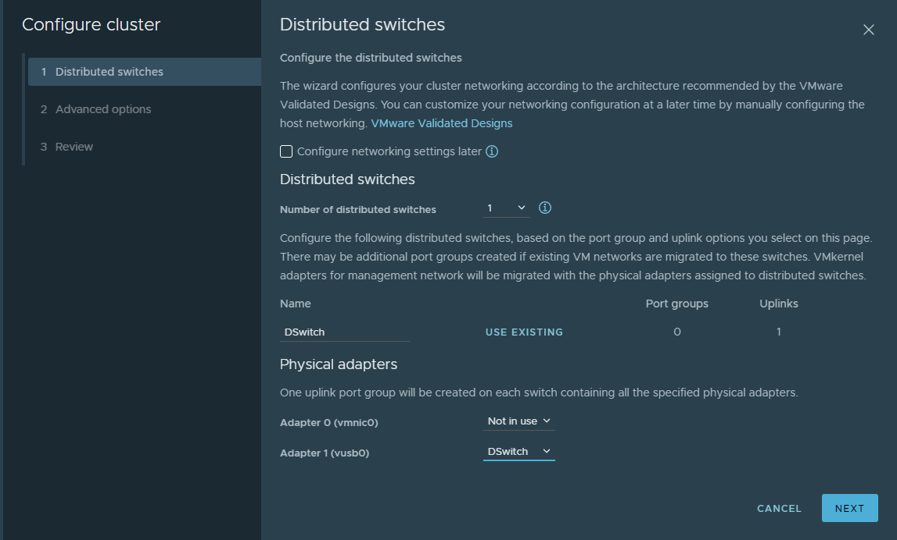

    3.  On the next screen there are Host Options and Enhanced vMotion
        Capability. I left both of these alone as my hosts are syncing
        to an NTP server already; secondly my processor family does not
        qualify for EVC since I am on consumer hardware.

    4.  For the final page, I reviewed my options and clicked Finish.  
          
        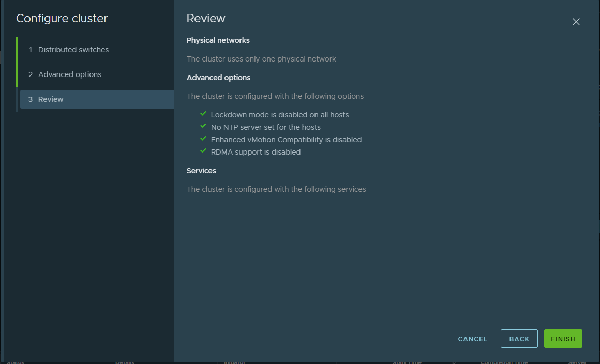

    5.  My two hosts are now in the cluster and have exited Maintenance
        Mode.  
          
        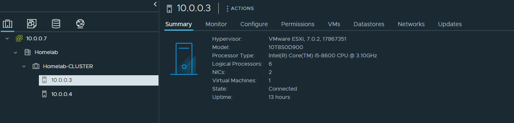

    6.  Something new I did not notice is a very tiny Photon OS was
        deployed to each host that was added to the cluster.

    7.  For my final host to be added to the cluster, I first need to
        add it to my Datacenter. I need to migrate vSphere over to a
        host that is currently in the Cluster so I do not lose my
        connection during configuration.

    8.  I forgot to enable vMotion on vmk0, so I quickly did that for
        each host in the cluster and the host I just added to the
        Datacenter. This will allow me to migrate the vSphere appliance
        to the cluster.  
          
        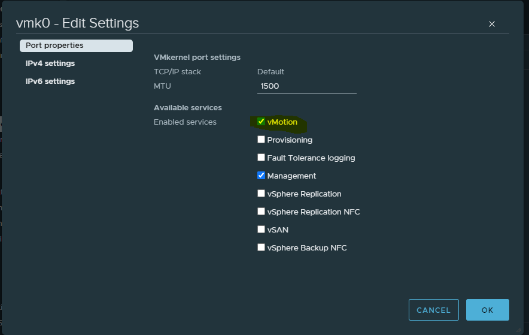

    9.  I will likely lose connectivity to the webclient during this
        time, so fingers crossed.  
          
        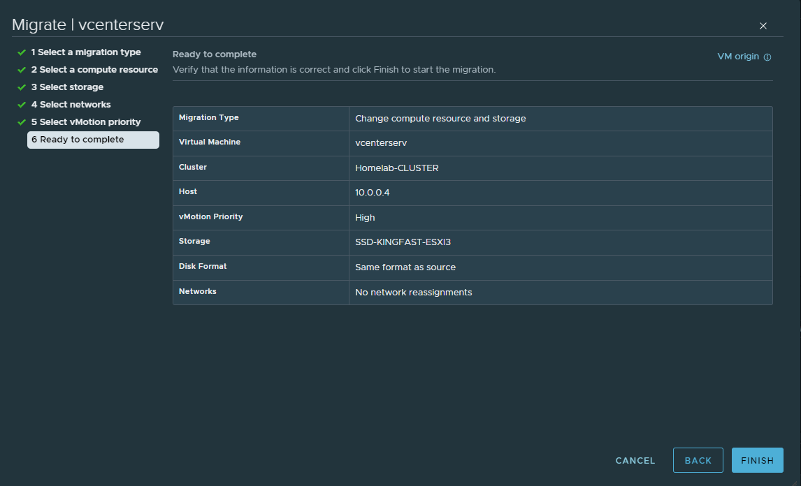

    10. Migration complete!  
          
        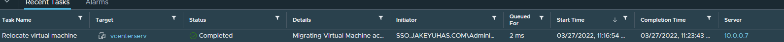

    11. I will now add **esxi1** into the cluster and have it configured
        using the same steps as above.

    12. Cluster configuration completed.  
          
        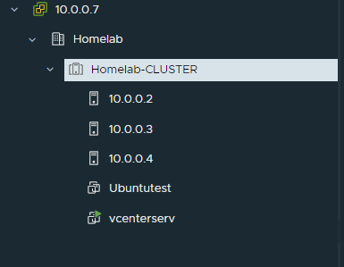

9.  Key takeaways

    1.  I did not know a small VMware Photon Virtual Machine is deployed
        to each host when a cluster is configured.

    2.  You cannot rename vCenter Server appliance without a DNS server.
        It needs to be able to resolve to the hostname selected. I.E.
        vcenterserv.ad.jakeyuhas.com needs to point to 10.0.0.7. I could
        use my public DNS records for this but do not want to expose my
        internal network. I will wait until I have a Windows Domain
        controller setup to distribute DNS and then will rename all my
        hosts/appliances as such.

    3.  Just common sense here, it is a very good practice to have a
        2nd vCenter Server appliance virtual machine deployed
        to any given cluster in case if one were to go down.

    4.  If you restart your single node vCenter server but want to see
        if it’s progressing back to an operational state, you can log
        into
        [**https://IPADDRESSHERE:5480**](https://IPADDRESSHERE:5480)
        with the **root** account (non SSO domain one) and go to
        **Services**. Look for **VMWare vSphere Client** and it should
        eventually say **Starting** and then after a bit of a wait
        **Started**.
