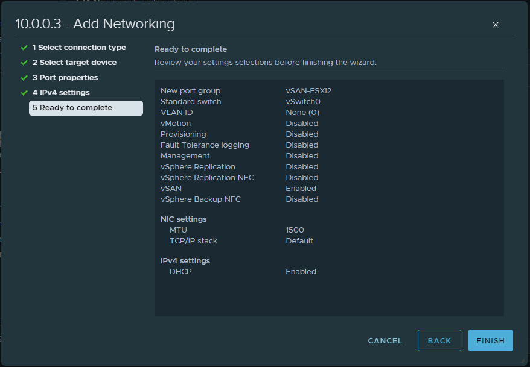

Summary of activities:

1.  VMKernal Adapter Configuration for vSAN

2.  Configuring vSAN

3.  Key Takeaways & Results

Before you begin:

-   Each host must have a total of 2 disks available for vSAN. So 3
    total including the disk which has ESXi installed

    -   Boot Disk: ESXi

    -   Cache Disk: SSD, M2 NVMe or USB Flash Drive

    -   Capacity Disk: SSD, M2 NVMe or HDD.

-   Ensure your 2 vSAN disks (cache and capacity) have been cleared of
    their partitions

-   If you are using USB flash drives as either storage or cache please
    be sure to complete these steps

    -   Login to each host via SSH

    -   Run the following command: **esxcli system settings advanced set
        -o /VSAN/AllowUsbDisks -i 1  
        **

    -   Log in to each host’s web interface

    -   Go to Manage \> System \> Advanced Settings

    -   Use the search bar on the right-hand side to search for
        **Disk.AllowUsbClaimedAsSSD** and set to 1

    -   Plug in your USB Flash drive devices and ensure they are marked
        as **SSD** and not HDD. If they are not marked as an SSD device,
        you must mark them as a flash device.

1.  Ensure each host has a dedicated VMKernel Network Adapter set for
    vSAN.

    1.  Click on the host you wish to configure a VMkernel adapter for
        vSAN

    2.  Click on **Configure  
        **

    3.  Click on **VMkernel Adapters  
        **

    4.  Click on **Add
        Networking  
          
        **

    5.  In this example, I am using 10.0.0.3 which is **esxi2**  
          
        (Steps continue on next page)

    6.  On *Select connection type* select **VMkernel Network Adapter  
          
        ****  
        **

    7.  For a target device, since this is a lab, click on **Select an
        existing standard switch**. Then click **Browse**. Select
        **vSwitch0** for now. In an enterprise environment, you may have
        a different switch setup for this.

    8.  On the *Port Properties* section, label the Network as
        **vSAN-ESXI2** or whatever else you want to name it. Just place
        **vSANAdapter** if you don’t know what to set it to.  
          
        (Steps continue on next page)

    9.  Also within the *Port Properties* section, check the box that
        says **vSAN** under *Enabled Services*.  
          
          
          
        (Steps continue on next page)

    10. Within *IPv4 Settings* use **Obtain IPv4 settings
        automatically** to keep things simple. If you know your network
        is setup differently and do not have a DHCP server available,
        you can use a static IP if you wish.  
          
        

    11. On the *Ready to Complete* page, click on **Finish.  
          
        **

    12. Perform the Vmkernel adapter creation for vSAN on all three
        hosts using the same steps above.

2.  Configuring vSAN

    1.  Click on the Cluster you wish to configure vSAN

    2.  Click on **Configure  
        **

    3.  Scroll all the way to the bottom of the configure page and you
        will see **vSAN**, drill down to see the **Services**, select
        that and you will see the vSAN Services Page open.  
        **  
        ****  
        **

    4.  Click on **Configure vSAN  
        **  
        (Steps continue on next page)

    5.  We will be creating a **Single Site Cluster** as all of our
        hosts are in the same “datacenter” and right next to each other
        on the same network.  
          
          
        

    6.  On the next page, *Services*, keep everything set to default and
        click **Next  
          
        **(Steps continue on next page)

    7.  On the Claim disks page, you will select your **Capacity** and
        **Cache** disks. For my setup, I am using USB drives, marked as
        Flash SSDs as my Cache disks. I am using an internal NVMe M2
        drive as Capacity. This is NOT supported in an enterprise
        environment. However, in an enterprise environment you need at
        least 2 disks available for vSAN (3 if you count the ESXi
        install). You need 1 SSD for caching, and 1 SSD/HDD for
        Capacity.  
          
        

    8.  On the review page, review your settings and click **Finish**.

    9.  vSphere will then update the vSAN configuration on all of your
        hosts that you had selected for the configuration. Keep an eye
        on the recent tasks bar at the bottom of the screen to see the
        progress and be patient.  
          
          
          
        (Steps continue on next page)

    10. When it is completed, all three nodes should appear as
        healthy.  
          
          
          
        (Key take aways on next page)

3.  Key Take-aways

    1.  During my installation, the third node, **esxi3** had failed. I
        spent about 3-4 hours troubleshooting this alone. I used
        different USB drives, but it would not work, the error claimed
        that the cache drive (USB drive) was failing. After extensive
        troubleshooting, I had removed the host from the cluster
        entirely and rebooted it. Upon reboot, I attempted to clear to
        partition tables from the Capacity and Cache drives. They would
        not clear. I discovered that the vSAN datastore was leftover on
        esxi3, and it would not let me delete it.  
          
        I had to follow the steps of this guide:
        <https://www.virtualizationhowto.com/2021/03/force-delete-vsan-datastore-from-esxi-host/>

        1.  Take host out of cluster (done already)

        2.  Place host into maintenance mode (done already)

        3.  Open SSH to Esxi3 (this is where I began the steps)

        4.  Connect via SSH to Esxi3

        5.  Run command: **esxcli vsan cluster leave  
            **

        6.  Run command: **esxcli vsan cluster get** (to make sure it
            left the cluster)

        7.  Then I ran **esxcli vsan storage list** to retrieve the UUID
            of the vsan storage group.

        8.  After retrieving that, I executed **esxcli vsan storage
            remove --uuid vsanuuidhere  
            **

        9.  After removing the vsan storage based on UUID, I went back
            into the web interface and cleared the partition tables on
            the USB drive (Cache) and the NVMe M2 drive (Capacity).

        10. I rejoined the host to the cluster and allowed it to apply
            it’s cluster settings and then re-attempted to create the
            disk group. It worked this time and my vSAN cluster was
            fully configured.

    2.  2nd key takeaway: If you are going to use vSAN in
        enterprise, make sure to have like a billion hosts instead of 3.
        You need 3 to fully support vSAN.**  
        **
