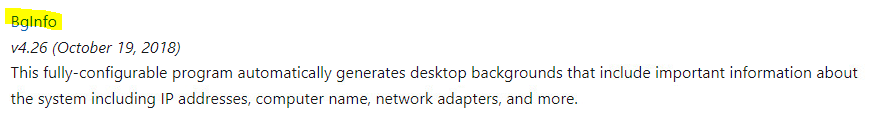
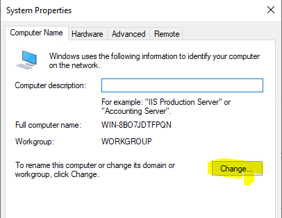

Summary

1.  Select a hyper-visor of your choice. ESXi… Hyper-V…VMWare
    Workstation… anything!

2.  Create Virtual Machine and name it **WIN2022_TEMPLATE**

3.  Install Windows Server 2022 (Follow lab 4)

4.  Login when the installation is complete

Process:

1.  Follow lab 4 to create and install a new Windows Server 2022 virtual
    machine. However, name the virtual machine **WIN2022_TEMPLATE  
    **

2.  When lab 4 is completed, the first thing you will do is install
    VMWare tools. To do this, log into vCenter Server and right-click on
    the Virtual Machine. Hover over **Guest OS** and then a secondary
    menu will appear. Click on **Install VMWare Tools…** (for those
    using a different hypervisor this process is relatively the same.
    Install the Guest OS tools for the hyer-visor that you are using.
    Hyper-V calls this *Guest Services*, VMware’s version is called
    *VMWare Tools*).  
      
      
      
    When the window appears.. click on **Mount**.

3.  After clicking on Install VMWare tools, log into your virtual
    machine and open up the file explorer. There should be a **DVD
    Drive** now appearing called **DVD Drive (D) VMWare Tools**.
    Double-click this “DVD” drive.  
      
    

4.  The installation should begin immediately and a VMWare Tools Setup
    install wizard should appear. Click **Next** all the way through,
    keeping everything default.  
      
    

5.  When the Installer has finished, it will ask if you wish to restart
    to have the changes take affect. Click **YES** on this window.  
      
    

6.  When your virtual machine comes back online, you should now get a
    better console window that resizes to fit to your screen. If not,
    close and re-open the console window from vCenter Server, it should
    re-adjust. Please keep in mind that, if VMWare tools ever gets
    updated, you should always run this installer again on the virtual
    machine template. Same with Windows Updates.

7.  Log back into your server, and close the Server Manager if it
    automatically opens.

8.  Open the File Explorer and go to your C: drive, and make a new
    folder called **Sysadmin Tools**.  
      
    

9.  Navigate into the **SysadminTools** folder.

10. Open Microsoft Edge in your virtual machine and navigate to
    <https://docs.microsoft.com/en-us/sysinternals/downloads/>

11. Scroll down until you see **Bginfo** and click on it’s hyperlink  
      
    

12. On the next page, click **Download BgInfo**  
      
    

13. This will download a file to your Downloads folder. Navigate to your
    Downloads folder, and move it to C:\SysadminTools

14. Once **BgInfo** is in the C:\SysadminTools directory, right click
    **Bginfo.zip** and click **Extract All**.

15. Click **Extract** when the window opens. It should extract to
    **C:\SysadminTools\BGInfo  
      
    ****  
      
    **

16. Close the new Windows Explorer window that opens. Do not do anything
    else with BGInfo, this is just to place it here ahead of time so
    that when you do deploy a new VM template, it is easily accessible
    and ready to install.

17. Close all other Windows Explorer windows.

18. Next, at the bottom left hand corner of the screen, click the Start
    Button and then **Right click** on Windows Powershell, hover over
    **More** and then click on **Run As Administrator**.  
      
    

19. A new Powershell window should now be open. In this window, type the
    following command: **Set-ExecutePolicy -ExecutionPolicy ByPass** and
    then hit Enter.

20. A warning will appear, type **A** to select *Yes to All* and then
    hit ENTER again.  
      
    

21. The command should complete with no output.

22. Close the Powershell Window.

23. Next you will click the **Start Button**, then click on
    **Settings**.  
      
    

24. The Windows Settings will open, click on **Update & Security  
      
    ****  
    **

25. This will open the *Windows Update* section. Click on **Check For
    Updates**.  
      
    

26. It should begin downloading and installing the latest updates
    automatically. Depending on your hardware, CPU, RAM, Local Area
    Network and Internet Service Provider, this can take time. Allow
    this to run… go grab some coffee.  
      
    

27. Allow all the updates to finish installing. Skip the optional
    quality updates as those are typically previews. If your virtual
    machine requires a reboot to commit an update, please do so now. To
    check and see if a Windows Server is pending a reboot, click on
    **View Update History**.  
      
    

28. This page will list whether an update is installed or **pending a
    reboot**, since we recently downloaded the Windows Server 2022
    Evaluation ISO, I did not have any new Cumulative updates for the
    Operating System. These Cumulative updates include <u>security</u>
    updates for the operating system that should be installed monthly.  
      
    

29. The final step we will perform in the operating system is enable
    remote desktop connections to be allowed to remotely connect to the
    Windows Server. To do this, go back to the **Windows Settings**
    page. (Start Button -\> Settings Cogwheel)

30. At the top of the Windows Settings page, you will see *Find A
    Setting* with a text box. Type **Remote Desktop** in that text box.
    Results should preview below the textbox as you begin typing, click
    on **Allow remote connections to this computer**.  
      
    

31. Scroll down until you see **Remote Desktop** as a heading. There
    will be a blue checkbox showing *Change settings to allow remote
    connections to this computer*. Click on **Show Settings**.  
      
    

32. A dialog box will appear, within the **Remote Desktop** section of
    this dialog box, click the radio button that says **Allow remote
    connections to this computer**. This will prompt a warning window
    stating that you are opening up the remote desktop protocol for all
    network types… just click **Ok** for now.  
      
    

33. Click **Apply** and then **OK**.

34. Close the **Windows Settings** window.

35. If you know how to use RDP/Remote Desktop Protocol, you may test it
    at this time to make sure you can connect. At this time, you may now
    gracefully shut down the virtual machine as we will convert this
    virtual machine into a template next.  
      
    

36. Once the Virtual Machine is completely shut down, log into the
    vCenter Server / vSphere Console.

37. Optional: Click on the **WINDOWS2022_TEMPLATE** virtual machine you
    just shut down and you may modify the **CPU** and **RAM** only. Set
    it to your personal preference. If there is no preference, keep it
    at **2 CPU** and **4GB of RAM** as those are the bare minimum
    requirements for Windows Server 2022 (Desktop Experience). <u>Make
    sure to disconnect the DVD/CD Drive Windows Installation
    Media!!!</u>

38. Right-Click on **WIN2022_TEMPLATE**, click on **Template** and then
    click on **Convert To Template**.  
      
    

39. When the warning window appears, click **Yes**, stating that you
    wish to convert the virtual machine **WIN2022_TEMPLATE** to a
    template.  
      
    

40. The virtual machine should now disappear from your virtual machine
    inventory.

41. If you click on the “file” looking icon at the top left of the
    vSphere console, you will see a folder structure. It should be
    sitting under the **Templates** directory now.  
      
    

42. Ok… so great. Now how do we use it? Great question.

43. Right-Click on your Cluster or Host and create a new virtual
    machine.  
      
    

44. This time… you want to select **Deploy From Template** and then
    click next.  
      
    

45. Now you can select it from your Content Library or Data Center hosts
    (VMWare). Your experience may vary in other hyper-visors such as
    Oracle VirtualBox. Select the template you just created,
    **WIN2022_TEMPLATE** and click next.  
      
    

46. Then… configure your virtual machine as you normally would. Give it
    any name you want. In VMWare it will give you some clone options, I
    don’t select any and click next until the wizard is finished.

47. Your hypervisor will now clone from the template and create the new
    virtual machine.

48. **Make sure to not forget to disconnect the Windows Installation
    media from the Virtual Machine, I forgot to include this earlier in
    the process before converting the template into a Virtual Machine.
    Always check and make sure just in case you forgot when making the
    template.  
      
    ****  
    **

49. Power on your virtual machine!

50. Open the console and it should lead you straight to the CTRL+ALT+DEL
    screen, go ahead and log in.

51. Once you are logged in the **Server Manager** window will open, this
    time don’t close it!

52. Click on **Local Server** in the Server Manager.  
    **  
    ****  
    **

**  
**

53. The very first field you should see on the left side is **Computer
    Name**, go ahead and change that to whatever name you gave the
    virtual machine. Now is also the time to join the domain if you have
    one present. If you don’t, then just change the computer name.

54. To change the Computer name, click on the actual name.  
      
    

55. This will open a new dialog window. Click on **Change**.  
    **  
    ****  
      
    **

**  
**

56. Another dialog window will open, go ahead and change the **Computer
    Name** (and optionally the domain you wish to join as well), then
    click **Ok**. After you click Ok, it will think for a minute…. Then
    a dialog box will appear stating that you need to reboot your
    machine. Click **Ok**.  
      
      
    **  
    ****  
    **

**  
**

57. After you click ok the dialog boxes will close. Close the **System
    Properties** dialog box as well, along with Server Manager.

58. Reboot your Virtual Machine to apply the name change.  
      
    

59. When the virtual machine comes back online, log back in and open
    **Powershell**.

60. In Powershell, type **hostname** and press enter. It should now
    reflect the name you just changed the Windows virtual machine to.  
      
    

61. Close Powershell and open Windows Explorer. Navigate to
    **C:\Sysadmintools\BGinfo**

62. Double click on **Bginfo64  
      
    ****  
    **

**  
**

63. Click on Agree for the License Agreement  
      
    

64. The application should install and immediately open, click on
    **Apply** and then **OK**.  
      
    

65. Now minimize your window and look at your desktop. You will notice
    some information populating over your Desktop image background.

**  
**

66. If you change your desktop background just to be black, it makes it
    easier to read. This is how we have it set up at my work.  
      
    

67. You are complete!

68. Key Takeaways:

    1.  Don’t forget to disconnect the Windows Installation Media when
        converting a Virtual Machine to a template.

    2.  You can install other programs such as Google Chrome, Firefox,
        Office products etc, as many as you’d like when making a
        template.

    3.  I for the most part followed Microsoft’s guide which is located
        here:
        <https://docs.microsoft.com/en-us/azure/cloud-adoption-framework/manage/hybrid/server/best-practices/vmware-windows-template>
