Summary

1.  Select a hyper-visor of your choice. ESXi… Hyper-V…VMWare
    Workstation… anything!

2.  Create Virtual Machine and name it **DC01**

3.  Install a clean copy of Windows Server 2022. Use Lab 4 or Lab 5
    depending on if you have a VM template created.

4.  Login when the installation is complete

5.  Optional: I advise that you reserve the IP Address of this virtual
    machine if you are running a DHCP server. Bind the IP to the MAC
    address.

Process:

1.  Open **Server Manager** and allow for the window to load fully.**  
      
    **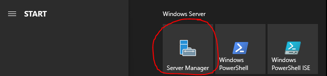**  
    **

2.  On the upper right-hand corner of Server Manager, click on
    **Manage** and then click on **Add Roles And Features**.  
      
    

**  
**

3.  A new window will open called **Add Roles and Features** wizard, go
    ahead and click **Next**.  
      
    

4.  On the **Select installation type** screen, make sure the
    **Role-based or feature-based installation** radio button is
    selected, and click next.  
      
    

5.  On the **Select destination server** screen, make sure the **Select
    a server from the server pool** radio button is selected and that
    the virtual machine you are on is selected below in the **Server
    pool**. My server that I am targeting is **DC01**. Click **Next**.  
      
    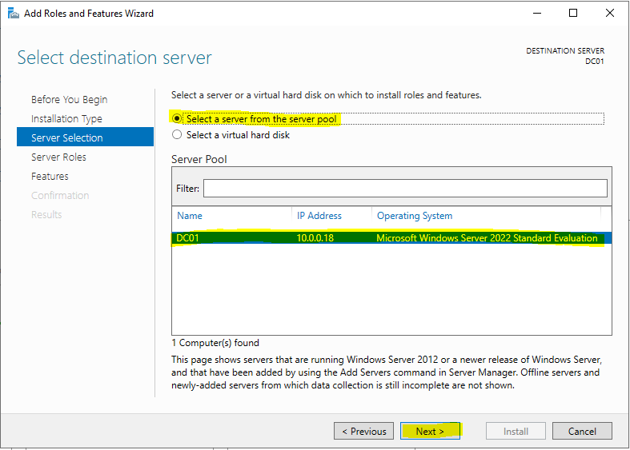

6.  On the **Select server roles** page, you will then click the
    checkbox next to **Active Directory Domain Services**.  
      
    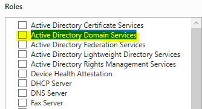

7.  An **Add Roles and Features** **Wizard** pop up window will open,
    make sure **Include management tools (if applicable)** is checked
    and then click on **Add Features**.  
      
    

8.  Click on **Next**  
      
    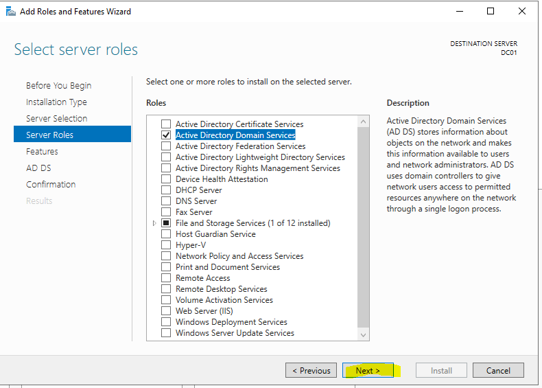

9.  On the **Select Features** page, keep everything default and just
    click **Next**.  
      
    

10. On the **Active Directory Domain Services** page, click **Next**.  
      
    

11. On the **Confirm installation selections** page, click on
    **Install**.  
      
    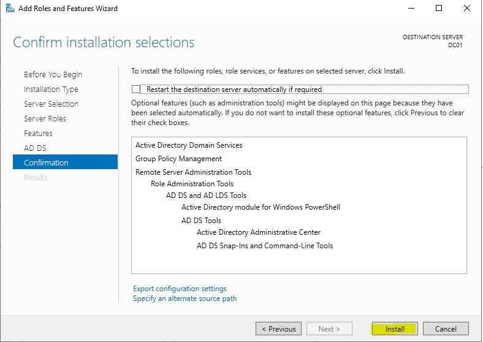

12. This will take some time, so go grab a drink of water. Then continue
    onto the next page when it is completed.

13. Once the installation as finished you will see a small hyperlink in
    the Installation Progress page that says **Promote this server to a
    domain controller**, go ahead and click on that link.  
      
    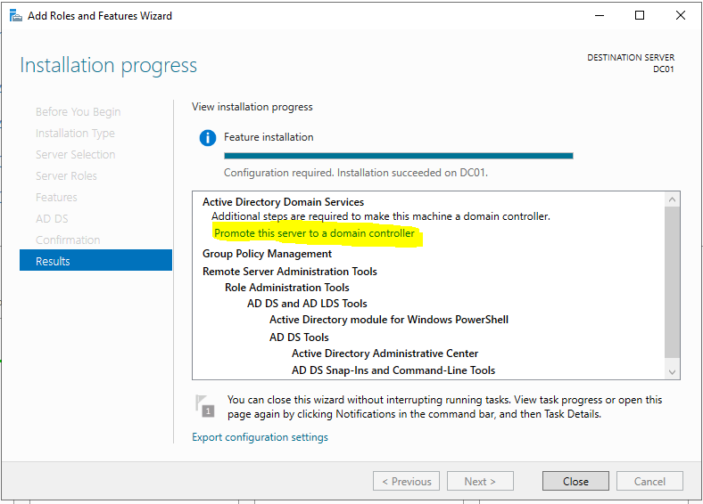

14. The **Active Directory Domain Services Configuration Wizard** will
    then open.

15. On the **Deployment Configuration** page, select the **Add a new
    forest**.

16. For the **Root Domain Name**, if you own your own public domain I.E.
    (jakeyuhas.com) what you can put here is **ad.yourdomain.com**.

    1.  The extra “ad” before the “yourdomain.com” practically creates a
        sub-domain of the domain that you own. This is so that your
        devices within the *ad.yourdomain.com* homelab domain, will
        never reach out to the internet for DNS.

    2.  You should **NEVER** use random top level domains as they can be
        registered by someone else and cause issues with your internal
        homelab if they were to ever reserve the same exact Root domain
        name as your homelab.

    3.  If you do not have a domain name that you own, you may use
        **ad.sillybusses.net** here as I own **sillybusses.net** and
        will never reserve **ad.sillybusses.net** out in the internet,
        ever. However, I do recommend buying your own domain/.com name
        as it’s extremely cheap.

17. Once you have the options set, click on **Next**.  
      
    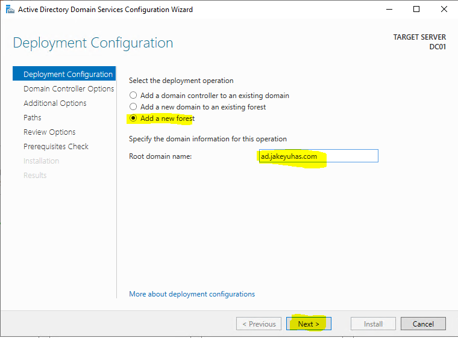

**  
**

18. On the **Domain Controller Options** page, the following should be
    set:

    1.  Forest functional level: **Windows Server 2016  
        **

    2.  Domain functional level: **Windows Server 2016  
        **

    3.  Specify domain controller capabilities:

        1.  Domain Name System (DNS) server: is **checked**

        2.  Global Catalog (GC): is **checked**

        3.  *Read only domain controller (RODC):* is <u>not checked</u>.

    4.  For the password, enter in a decent password that you will
        remember forever.

19. Once you have reviewed the selections and entered the password click
    on **Next**.  
      
    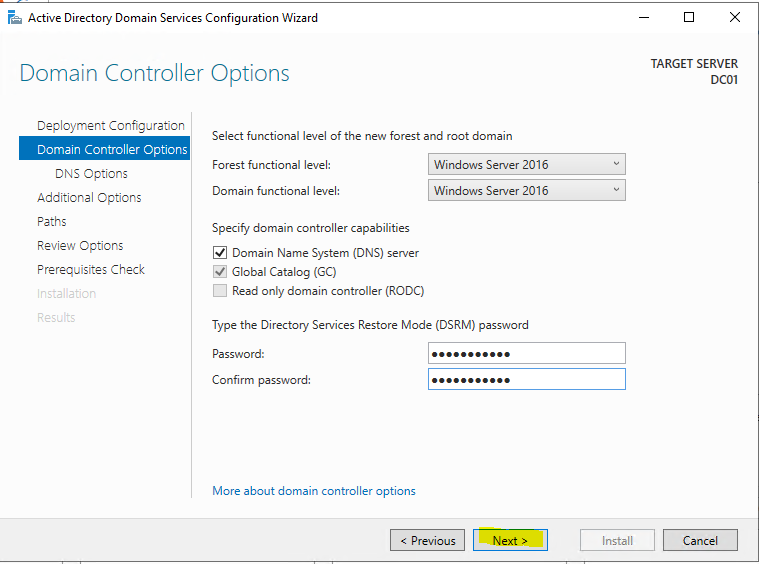

**  
**

20. On the **DNS Options** page, just click **Next**.  
      
    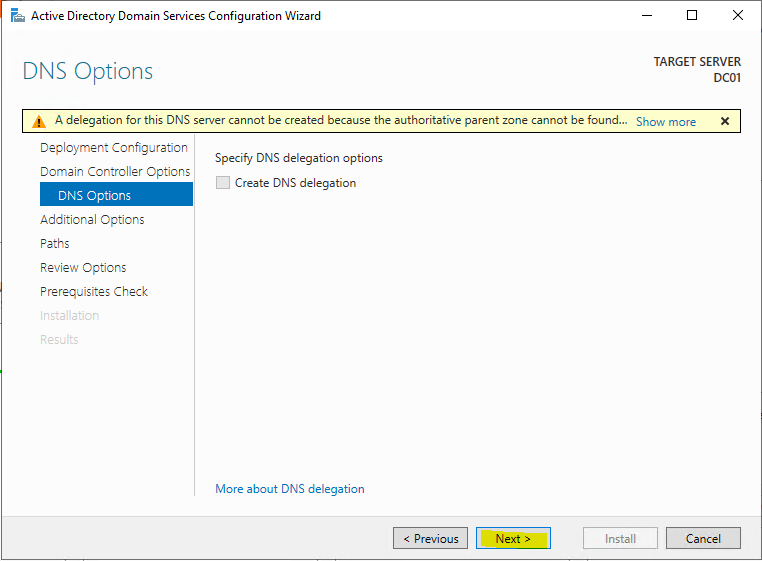

21. On the **Additional Options** page, the **NetBIOS domain name**
    field should be set to just **AD**. So whenever you log into a
    domain joined server, workstation etc, the login credentials will be
    *AD\usernamehere* for the username fields.  
      
    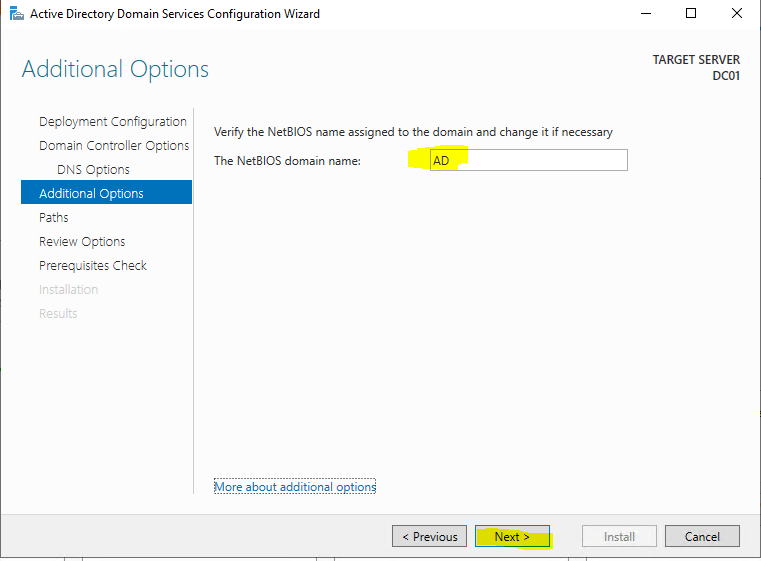

22. For the **Paths** page, keep everything default and click
    **Next**.  
      
    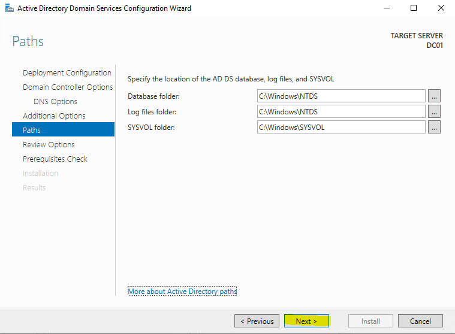

23. On the **Review Options** page, click **Next**. In the real-world on
    the job, you would truly review this page… but this is a lab
    environment.  
      
    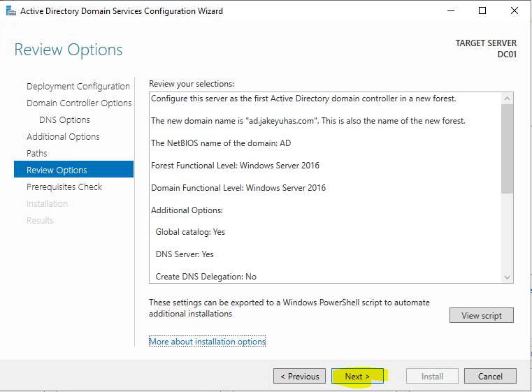

24. On the **Prerequisites Check** page, just click **Install**. You may
    see some warnings appearing but they can be ignored in this case
    since we are in a lab environment. In the real-world, I would be
    generally concerned if my domain controller only had 1 physical NIC
    available.  
      
    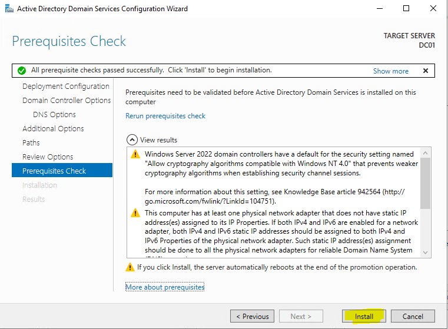

25. After clicking **Install**, the server will take a bit to install
    and finish the final configurations. The server will reboot on it’s
    own when it is done. So you may see *You’re about to be signed out*
    appear, along with your RDP session/console rebooting for your
    virtual machine.  
      
    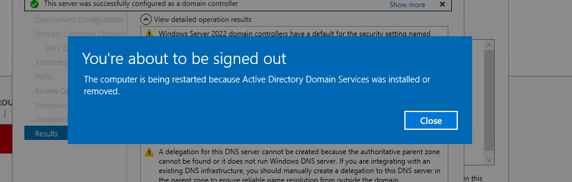

**  
**

26. When the virtual machine comes back online, you will now have to log
    in as **AD\Administrator** for the username.

27. When you log in as **AD\Administrator** to the desktop, you are
    technically finished. However, one thing to note here is that on a
    domain controller, no local user accounts exist anymore. It is all
    managed through Active Directory.

28. If you click on the Start button  and then navigate to
    **Windows Administrative Tools** you should now see a few Active
    Directory tools listed.  
      
    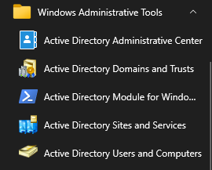

29. Click on **Active Directory Users and Computers**

30. A new window will open, drill down into the **ad.yourdomain.com**
    domain and click on **Users**. It should populate the right side of
    your screen with user accounts and groups.  
    **  
    **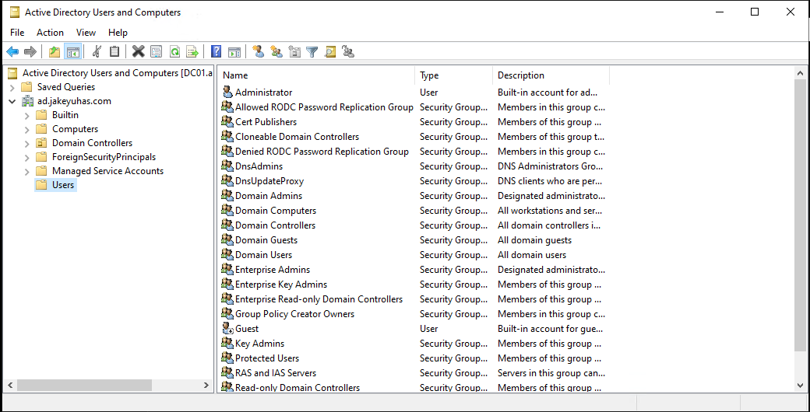**  
    **

**  
**

31. Right-click on **Users** and hover over *New* and then click
    *User*.  
      
    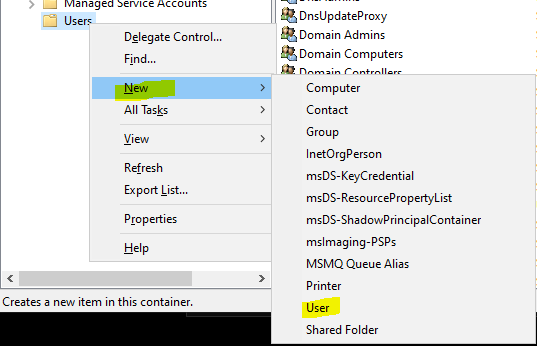

32. A **New Object – User** window will appear. Fill in the following:

    1.  First Name: **John**

    2.  Last Name: **Doe**

    3.  Full Name: **John Doe**

    4.  User Logon Name: **doej  
          
        **(lab continues on next page)

33. Click on **Next  
      
    **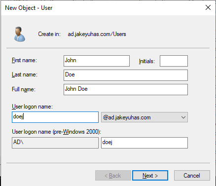**  
    **

34. On the next page, throw in the password: **reallysecure1234!!** and
    keep the **User must change password at next logon** checked. Then
    click **Next.**  
      
    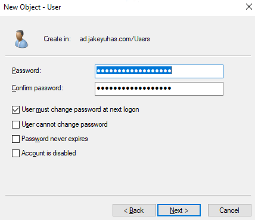

**  
**

35. Then click on **Finish  
    **  
    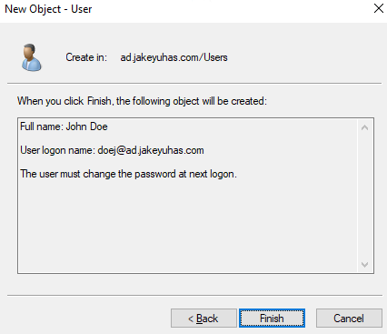

36. You should now see **John Doe** a user account, listed within the
    users.  
      
    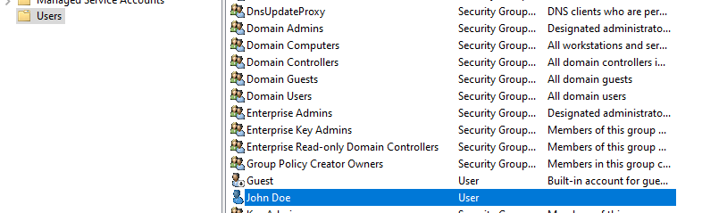

**  
**

37. Right-Click on **John Doe** and go to **Properties**  
      
    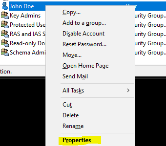

38. Click on the **Member Of** tab at the top and it should show you
    which groups John Doe is part of. By default, newly created user
    accounts will default to **Domain Users**.  
      
    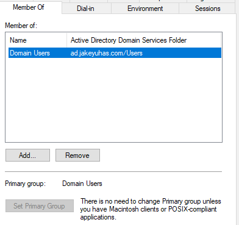

39. Close the window and sign out of **DC01**.

40. Now try to log back into **DC01** but as John Doe. To do this in the
    username field, you will put **AD\doej** and the password
    **reallysecure1234!!**  
    **  
    **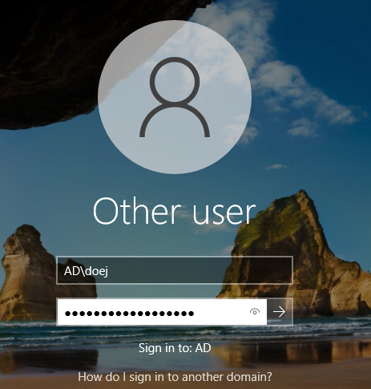**  
    **

41. The screen will then prompt that the password needs to be changed.
    Click **OK**.  
      
    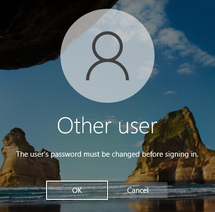

**  
**

42. Enter in a new password that is easy for you to remember. Then click
    the arrow button or press **Enter** to continue.  
      
    

43. It will state that the password was successfully changed.  
      
    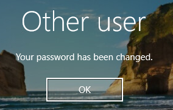

44. The Domain Controller probably won’t like that a non-administrator
    account is trying to sign in though. This is intentional for
    security purposes. You don’t want normal users able to access your
    domain controller. The **AD\doej** (John Doe) user account will be
    able to access any other domain joined computer though.  
      
    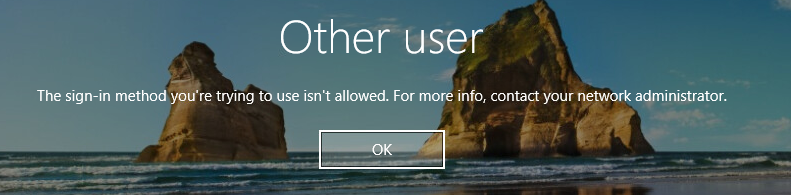

45. Let’s say John Doe is indeed an System Administrator and requires
    access to the domain controller. How can we fix that?

46. Log back into **DC01** as **AD\Administrator**

47. Open **Active Directory Users and Computers**

48. Right-Click on the user account **John Doe** and click **Add to a
    group….**  
      
    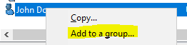

49. The **Select Groups** window will open. In the *Enter the object
    names to selects* textbox, type **Domain Admin**.  
      
    

50. Then click **<u>C</u>heck Names**.

**  
**

51. It should now underline and change your text to *<u>Domain
    Admins</u>*.  
    <u>  
    </u>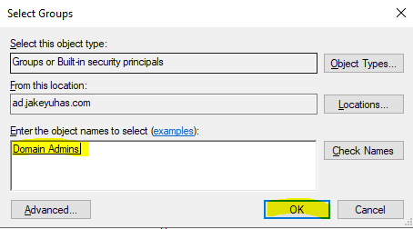<u>  
    </u>

52. Click **OK** to officially add **John Doe** to the Domain Admins
    security group.

53. An information window should pop up stating that it was
    successful.  
      
    

54. Within the **Users** folder, find the **Domain Admins** security
    group.

**  
**

55. Right-Click on the **Domain Admins** security group and click on
    **Properties**.  
      
    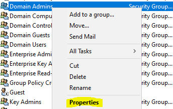

56. Within the **Domain Admins Properties** click on the **Members**
    tab, it should now show John Doe as a member of this group. Click OK
    to close after reviewing.  
      
    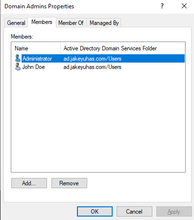

57. Logout of **DC01** and re-login to **DC01** as **AD\doej**.

58. It should authenticate and allow **AD\doej** (John Doe) to log in.

59. Open a Powershell or command prompt and type **netdom query fsmo**,
    this should show you the roles and which domain controllers have
    them. In the real world, you should have always at least 3 domain
    controllers online. If you ever lose one completely and it has the
    roles, you may seize the FSMO roles. [**You can follow this article
    from Microsoft here if you ever run into that daring but easily
    fixable
    situation.**](https://docs.microsoft.com/en-us/troubleshoot/windows-server/identity/transfer-or-seize-fsmo-roles-in-ad-ds)

60. Notes about the recent steps performed:

    1.  It is standard practice that the username of users, should be
        **\<lastname\>\<firstinitial\>** as logon credentials. So in
        John Doe’s case, it would be **doej**.

    2.  **WARNING:** Nobody but select System Administrators should be
        added to the **Domain Administrators** security group in a
        real-world on the job scenario. Domain Administrators have
        complete control and access to critical functionality of the
        domain itself. If this were to fall into the wrong hands of a
        hacker/outside threat, you will be spending the next six months
        to a year recovering data and rebuilding a domain from scratch.

    3.  The default Administrator account for a Windows domain is part
        of the **Domain Administrators** security group. Some
        organizations disable it but I personally disagree. If anything,
        the default Administrator account should be the
        **1st** of 2 backup Domain Administrator accounts and
        **NEVER USED** unless you lock out your own account.

    4.  I mentioned that there should be 2 backup Domain Administrator
        accounts. The first one is the default **Administrator** account
        which we used to configure the domain. The second domain
        administrator account is to be kept by HR or your CIO and never
        logged into…. only as a complete disaster recovery/contingency
        plan. If you ever become a System Administrator someday for a
        small to medium organization, you may be instructed to create a
        **Domain Administrator** account for HR or your CIO or your
        business owner as that backup plan.

        1.  The HR/CIO Domain Administrator account is never logged into
            unless:

            1.  You pass away and are the only Domain Administrator

            2.  You get fired/let go and they need to lock out your
                domain administrator account and user account.

            3.  Disaster Recovery, it should be the only account that
                remains untouched and used to recover from unforeseen
                circumstances.

    5.  It is a standard practice in my current organization in which
        System Administrators and Analysts are given two user accounts.

        1.  User Account: The normal account you use to perform work
            with email, Microsoft Office, responding to user tickets. In
            some cases, some of us have local administrator rights to
            our own work laptops to install local programs for testing.
            Otherwise, this user account has no permissions or elevated
            administrator privileges. This account cannot log into
            servers at all.

        2.  Administrator/Server Account: This is an elevated
            administrative account that has our name tied to it and is
            used to log into servers to perform maintenance tasks. We
            can install and remove programs on servers, reboot servers,
            shut down servers, configure servers etc. They may connect
            to specific monitoring programs such as VROPs, Nagios,
            AKIPs. The password on this account rotates on a timed basis
            (a few days).

        3.  Some organizations actually split of Domain Administrator
            into a third account that is given to System Administrators.
            Typically, never logged into at all for normal day to day
            tasks.

61. Notes Regarding Domain Controllers

    1.  Only permit Domain Administrators to access the server itself to
        see the desktop. NOBODY ELSE, should be able to log into the
        server itself. Other than a select few people.

    2.  You should ALWAYS keep at least **3 DOMAIN CONTROLLERS** online,
        with 1 of the 3 domain controllers in a different area of the
        building or at a completely different site but on the same
        VLAN/subnet.

    3.  When patching, updating, rebooting domain controllers you should
        only do 1 at a time, unless you have 20 different domain
        controllers.

    4.  Never use VMWare Snapshots, HyperV checkpoints or any type of
        backup method on Domain Controllers. If you restore a domain
        controller to a previous point in time when other domain
        controllers are present on the network, you will cause something
        called a **USN** **rollback**. This is a NIGHTMARE to fix. If a
        Domain Controller is unrecoverable, it is advised to install a
        brand new Windows Server OS on top of the old and join it to the
        domain, then promote it to a domain controller. When a Domain
        Controller goes, it is a lost cause for that specific node.

    5.  If you lose a domain controller and there are other domain
        controllers online, you can seize the FSMO roles

    6.  If your Junior Administrators/Help Desk need access to create,
        remove normal user accounts, set passwords and unlock user
        accounts, they can remotely manage that with **Active Directory
        Users and Computers** or the **Active Directory Administrative
        Center**, you may have to add them to a security group or group
        policy object that will allow for them to perform those actions,
        and ONLY those actions.  
          
        In addition to this, Junior Administrators/Helpdesk should also
        **<u>NOT</u>** be able to manage Domain Administrator accounts.
        You do **<u>NOT</u>** need to be a Domain Administrator to
        perform basic user account control for just user accounts. Be
        smart, and setup a hierarchy in case if the Junior
        Administrator/Helpdesk accounts were to ever be compromised.

62. This lab is officially complete. In the next lab we will deploy a
    new Windows Server VM and add a second domain controller to the
    domain.
