Summary

1.  Select a hyper-visor of your choice. ESXi… Hyper-V…VMWare
    Workstation… anything!

2.  Create Virtual Machine and name it **DC02**

3.  Install a clean copy of Windows Server 2022. Use Lab 4 or Lab 5
    depending on if you have a VM template created.

4.  Login when the installation is complete

5.  Optional: I advise that you reserve the IP Address of this virtual
    machine if you are running a DHCP server. Bind the IP to the MAC
    address.

Process:

1.  Log in with the local administrator account

2.  Right-Click the Start Button
    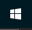
    and click on **System**.  
      
    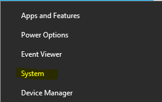

3.  The **About** page will open, scroll down to where it says **Related
    Settings** and click on **Advanced System Settings**.  
      
    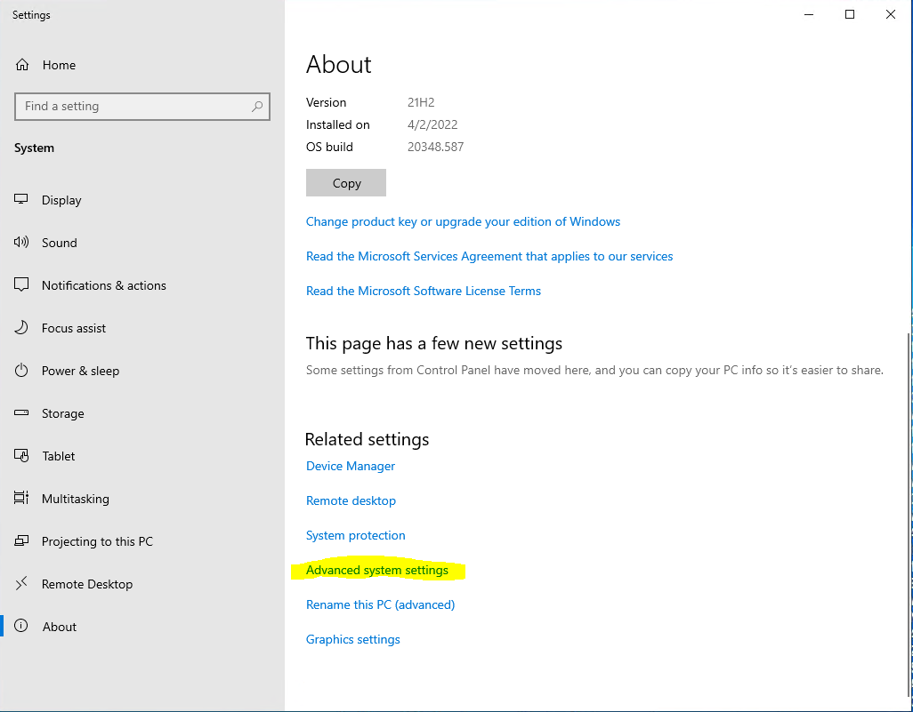

4.  Click on the **Computer Name** tab  
      
    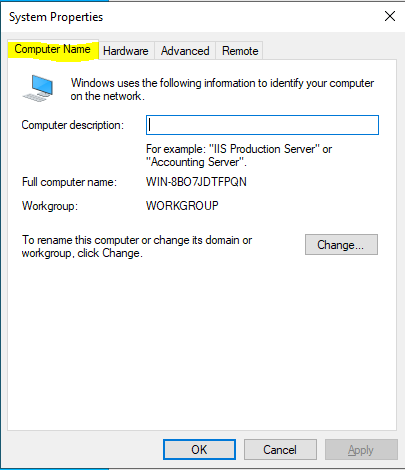

5.  Then click on **Change**

6.  For the **Computer Name** set it to **DC02**.

7.  Under **Member Of** select, **Domain** and enter the domain name you
    wish for the server to join.

8.  Click **OK** when the settings are set.  
      
    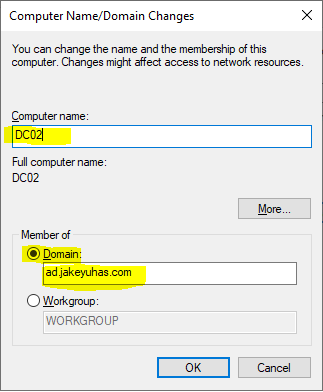

    1.  If you receive an error, you may need to change your DNS
        settings either locally on the computer to point to your domain
        controller’s IP address. In my case, it is 10.0.0.18. It should
        be in the first DNS entry slot.

    2.  Once you make this change whether on your DHCP server or within
        your IPv4 settings perform the following via Powershell or
        command prompt (Note if you are using an RDP session it will
        disconnect you, so do this from the console):

        1.  Ipconfig /release

        2.  Ipconfig /renew

9.  A new window will prompt after step 8 and will ask for the username
    and password of any domain account that has the authority to add a
    server/workstation to the domain. Enter **AD\Administrator** for the
    username and the password you have set and click **OK.**  
      
    

    1.  If you receive an error that the SID is the same (likely if you
        deployed from a template), you can run the following command in
        an elevated Powershell prompt, this will basically reset the
        entire VM so make sure to save any work:

        1.  **C:\Windows\\ system32\sysprep\sysprep.exe /generalize
            /shutdown /oobe  
            **

10. After a few moments, a window should appear welcoming the server
    into the domain.  
      
    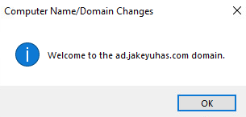

**  
**

11. Allow the server to reboot as well to apply the changes.  
      
    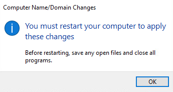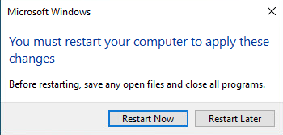

12. Once the server has rebooted, log in as **AD\Administrator**

13. Open **Server Manager  
      
    **
    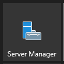

14. On the upper right-hand corner of Server Manager, click on
    **Manage** and then click on **Add Roles and Features**  
      
    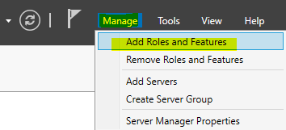

**  
**

15. A new window will open called **Add Roles and Features** wizard, go
    ahead and click **Next**.  
      
    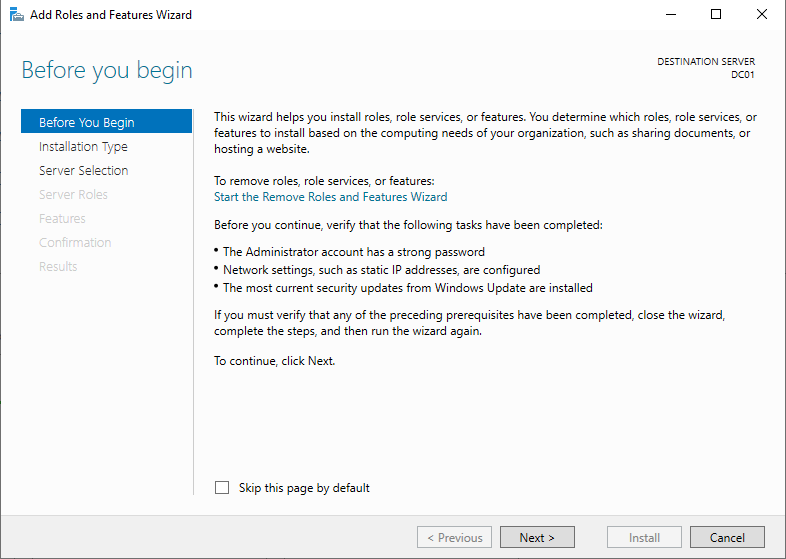

16. On **Select Installation Type** page, make sure the **Role-Based**
    **or feature-based installation** radio button is selected and click
    **Next**.  
      
    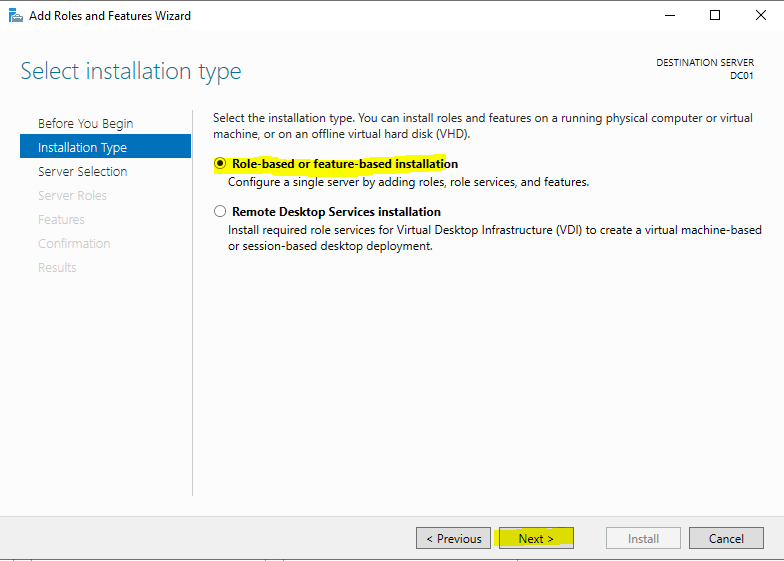

**  
**

17. On the **Select Destination Server** page, click on
    **DC02.ad.yourdomain.com** as the target. Make sure it’s highlighted
    and click **Next**.  
      
    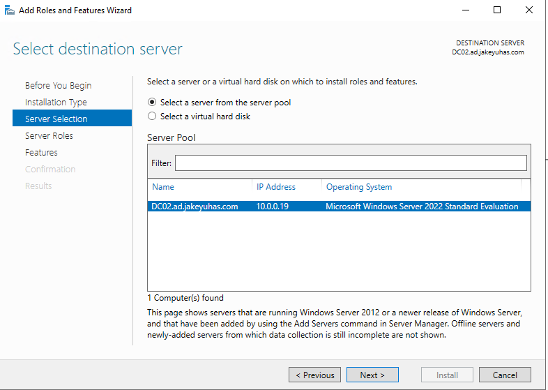

18. On the **Select Server Roles** page, you will then click the
    checkbox next to **Active Directory Domain Services**.  
      
    

19. An **Add Roles and Features Wizard** pop up window will open, make
    sure **Include Management tools (if applicable)** is checked and
    then click on **Add Features**.  
      
    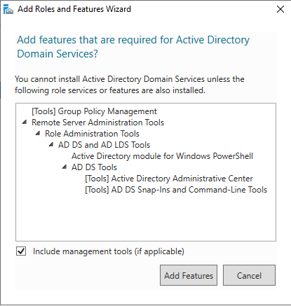

20. Click on **Next**  
      
    

**  
**

21. On the **Select Features** page, keep everything default and click
    **Next**.  
      
    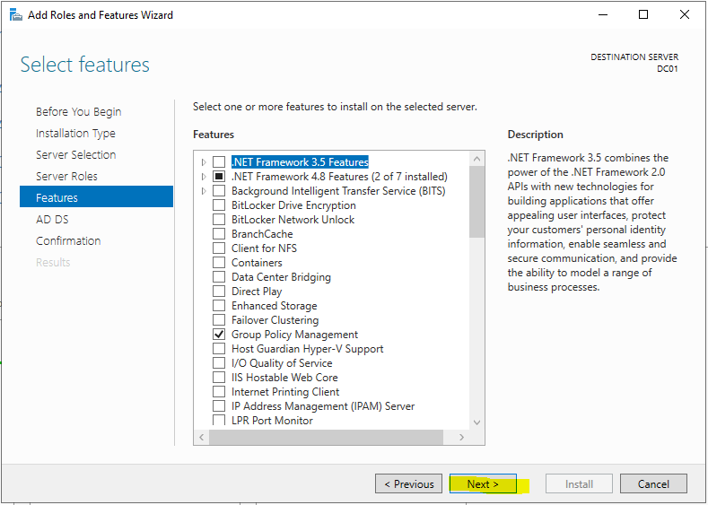

22. On the **Active Directory Domain Services** page, click **Next**.  
      
    

**  
**

23. On the **Confirm Installation Selections** page, click on
    **Install**.  
      
    

24. Take this time to go grab a coffee. Continue onto the next page when
    the installation as finished.

**  
**

25. Once the installation has finished you will want to click the
    hyperlink in the wizard window that states **Promote this server to
    a domain controller**  
      
    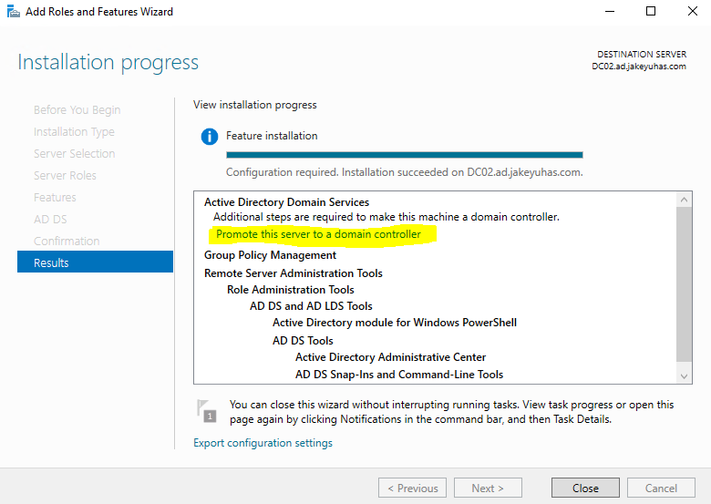

26. The **Active Directory Domain Services Configuration Wizard** will
    then open.

**  
**

27. Select the radio button that states **Add a domain controller to an
    existing domain**. Everything should be auto-filled, including the
    credentials. Then click **Next**.  
      
    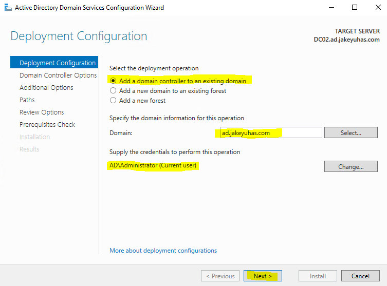

28. On the **Domain Controller Options** page, make sure the following
    are set:

    1.  **Domain Name System (DNS) Server** – **Checked**

    2.  **Global Catalog** – **Checked**

    3.  **Read Only Domain Controller (RODC)** – **NOT CHECKED**

    4.  **Site Name**: Default-First-Site-Name

    5.  **Directory Services Restore Mode (DSRM) Password:** Set this to
        something you can easily remember. In a production environment,
        it should be 15 characters minimum. However, for this lab, keep
        it simple.

**  
**

29. Review the options set and click **Next**.  
      
    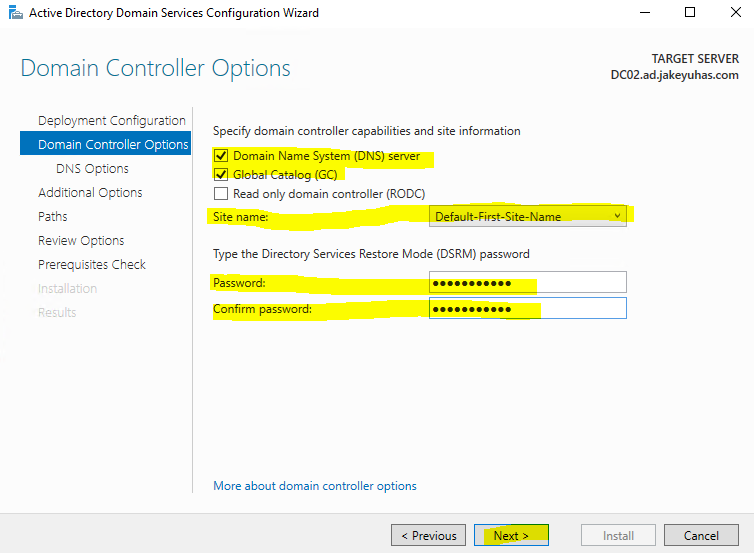

30. For **DNS Options**, just click **Next**.  
      
    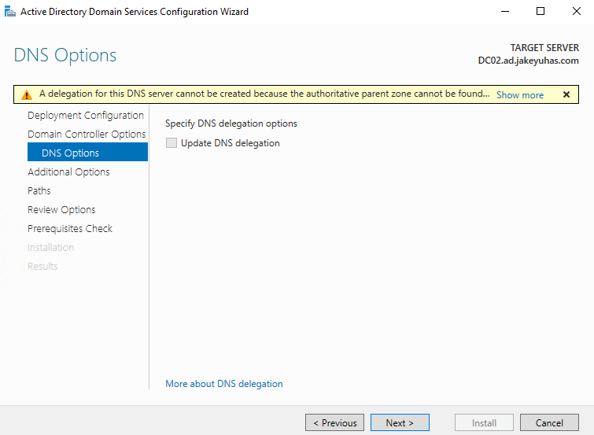

31. For the **Additional Options** page, make sure **Replicate From:**
    is set to **Any Domain Controller**, then click **Next**.  
      
    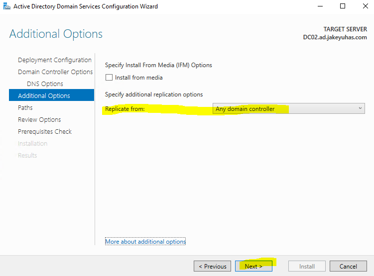

32. For the **Paths** page, keep these at default and click **Next**.  
      
    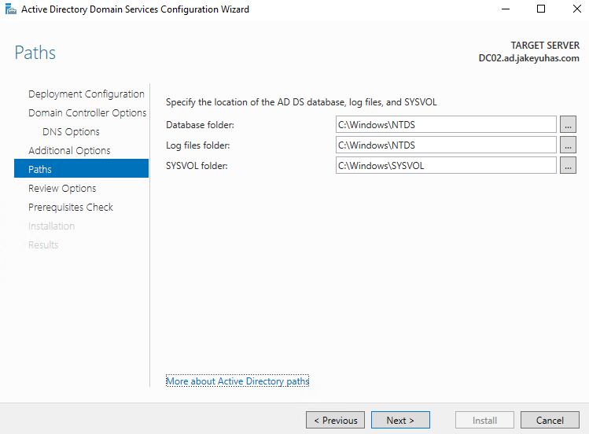

**  
**

33. On the **Review Options** page, click **Next**. In a real-world job
    scenario, you would likely be reviewing this to make sure your
    configurations are correct. Since this a lab, just click Next and
    ignore for now.  
      
    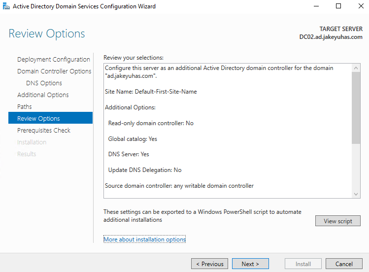

34. On the **Prerequisites Check** page, you may click **Install**. You
    may see some warnings, but since this is a lab environment, they can
    be ignored.  
      
    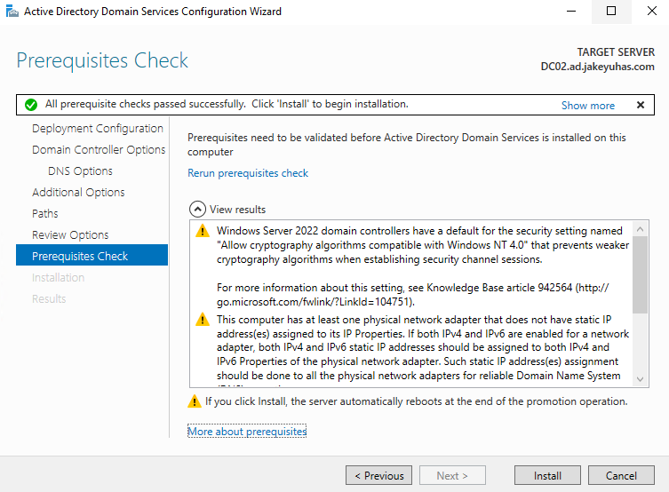

35. The installation will take some time. Give it a few minutes
    depending on how fast your hardware is. Once it is finished, you
    will be forced to sign out and the server will reboot.  
      
    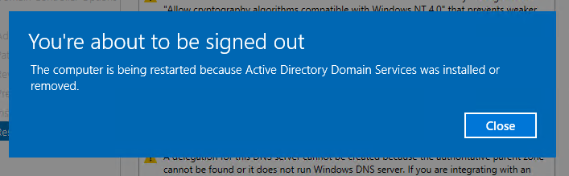

36. Once the server is back online, log back in and click on the Start
    Menu. Search for **Windows Administrative Tools** within the folder
    structure, once you find it, drill down and you should see the
    following Active Directory tools shown in the picture below.  
      
    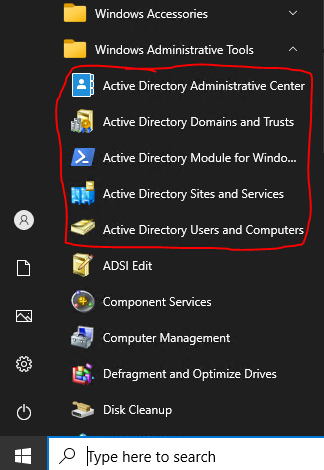

**  
**

37. Key Takeaways from Lab 6 and 7.

    1.  You learned how to create a brand-new Windows domain – Lab 6

    2.  You configured a domain controller – Lab 6

    3.  You learned how to join a server/workstation to a domain – Lab 7

    4.  You added a second domain controller for redundancy of Active
        Directory.

    5.  You learned how to create a new user account – Lab 6

    6.  You learned how to assign a user account to a security group –
        Lab 6

    7.  You were instructed on some best practices with Active Directory
        user accounts and Domain controllers. – Lab 6
